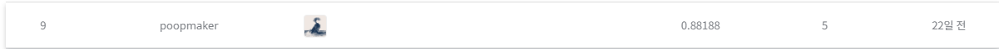

# 로그 분석을 통한 보안 위험도 예측 AI 경진대회

## 결과

### 요약정보

- 도전기관 : 시큐레이어
- 도전자 : 홍기헌
- 최종스코어 : 0.88188
- 제출일자 : 2021-11-05
- 총 참여 팀 수 : 160
- 순위 및 비율 : 9(5.625%)

### 결과화면

## 사용한 방법 & 알고리즘
방법1. 
- 날짜, 시간, 아이피어드레스, 포트, 한글, 숫자 마스킹
- 특수문자 제거
- 소문자 변환
- 중복제거
- CountVectorizer 사용 벡터화
- 위험요소 가정 추가: 예측 결과 0.7 이하인 경우, 이상치로 분류
- 알고리즘 random forest 사용

## 코드
['./loglog.py'](./loglog.py)

