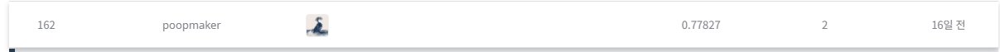

# 심리 성향 예측 AI 경진대회

## 결과

### 요약정보

- 도전기관 : 시큐레이어
- 도전자 : 홍기헌
- 최종스코어 : 0.77827
- 제출일자 : 2021-11-05
- 총 참여 팀 수 : 760
- 순위 및 비율 : 162(21.31%)

### 결과화면

## 사용한 방법 & 알고리즘
방법1. 
- 레이블 분리 / 테스트 세트 복제
- 스코어룰 정의
- 컬럼 수치화
- 레이블 인코딩 후 컬럼 인코딩
- 정규화(MinMaxScaler)
- 사용모델
  : lgbm
  : xgboost
  : catboost
  : random forest
  : extra tree
  : logistic
  : kneibor
- 하이퍼파라미터 오토튜닝
- 위의 모델 가중치 앙상블

## 코드
['./marchi.py'](./marchi.py)

