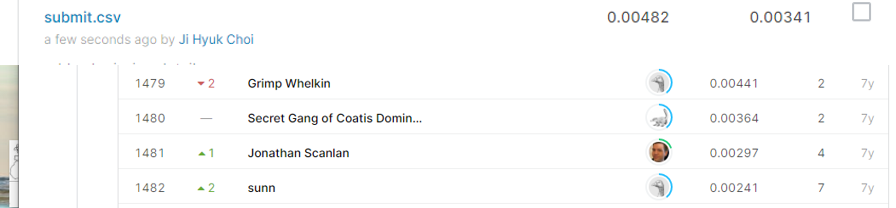

# Allstate Purchase Prediction Challenge

## 결과

### 요약정보

- 도전기관 : 시큐레이어
- 도전자 : 최지혁
- 최종스코어 : 0.00341
- 제출일자 : 2021-02-20
- 총 참여 팀 수 : 1568
- 순위 및 비율 : 1481(94.45%)

### 결과화면

## 사용한 방법 & 알고리즘
1. 대회설명

2. 데이터 설명
train.csv
 
test_v2.csv (train.csv와 동일 피쳐)
 

3. 알고리즘 설명
전처리와 lr

## 코드

['./allstate_purchase_prediction_challenge.py'](./allstate_purchase_prediction_challenge.py)

## 참고 자료

- 
