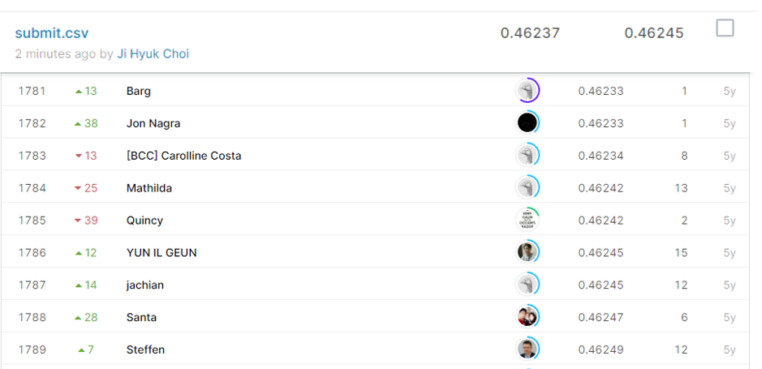

# BNP paribas cardif claims management

## 결과

### 요약정보

- 도전기관 : 시큐레이어
- 도전자 : 최지혁
- 최종스코어 : 0.46257
- 제출일자 : 2021-02-26
- 총 참여 팀 수 : 2923
- 순위 및 비율 : 1788(61.65%)

### 결과화면

## 사용한 방법 & 알고리즘
1. 대회설명
  BNP paribas cardif라는 보험사에서 주최하는 대회이다. 마스킹된 피쳐를 학습하여 boolean 형태의 답안을 예측하는 대회이다.

2. 데이터 설명: 
  str형 피쳐:   017 columns
  int형 피쳐:   002 columns
  float형 피쳐: 112 columns
  y값(target):   boolean 형태( 0/1)
	 

3. 알고리즘 설명:
  연관성 검사를 하여 추려낸 피쳐를 factorize로 인코딩한다. 이렇게 전처리된 피쳐들은 extraTreesClassifer로 모델로 제작한다.

## 코드

['./bnp_paribas_cardif_claims_management.py'](./bnp_paribas_cardif_claims_management.py)

## 참고 자료

- 
