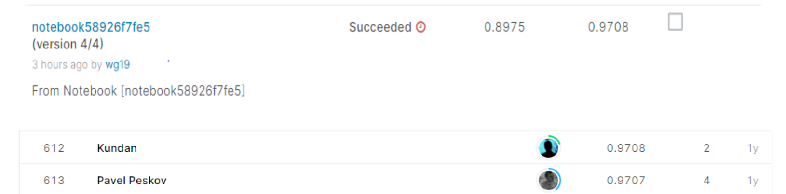

# Bengali.AI Handwritten Grapheme Classification

## 결과

### 요약정보

- 도전기관 : 한양대학교
- 도전자 : 왕격
- 최종스코어 : 0.9708
- 제출일자 : 2021-03-8
- 총 참여 팀 수 : 2059
- 순위 및 비율 : 613(29.78%)

### 결과화면

## 사용한 방법 & 알고리즘

CNN 모델을 사용했습니다.

- 결측값 채우기
- Feature engineering
  - Feature selection
- CNN model
  - 64 nodes
  - 512 nodes
  - 3 output

## 코드

[`./Bengali.AI.py`](./Bengali.AI.py)

## 참고 자료

- [dataset summary](https://arxiv.org/abs/2010.00170)
