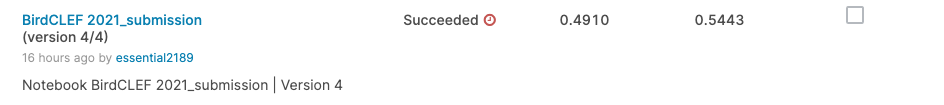
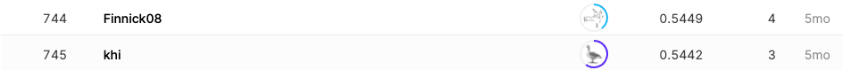

## BirdCLEF 2021 - Birdcall Identification

------------

### 결과

----------------

### 요약정보

* 도전기관 : 시큐레이어
* 도전자 : 왕승재
* 최종스코어 : 0.61918
* 제출일자 : 2021-10-21
* 총 참여 팀 수 : 816
* 순위 및 비율 : 745 (91%)

### 결과화면





----------

### 사용한 방법 & 알고리즘

* Sequential 모델

  * Sequential 모델은 레이어를 선형으로 연결하여 구성합니다. 레이어 인스턴스를 생성자에게 넘겨줌으로써 Sequential 모델을 구성할 수 있다.

  * Sequential 모델은 각 레이어에 정확히 하나의 입력 텐서와 하나의 출력 텐서가 있는 일반 레이어 스택에 적합하다.

  * ```python
    _________________________________________________________________
    Layer (type)                 Output Shape              Param #   
    =================================================================
    conv1d (Conv1D)              (None, 24, 64)            256064    
    _________________________________________________________________
    batch_normalization (BatchNo (None, 24, 64)            256       
    _________________________________________________________________
    max_pooling1d (MaxPooling1D) (None, 6, 64)             0         
    _________________________________________________________________
    conv1d_1 (Conv1D)            (None, 4, 64)             12352     
    _________________________________________________________________
    batch_normalization_1 (Batch (None, 4, 64)             256       
    _________________________________________________________________
    flatten (Flatten)            (None, 256)               0         
    _________________________________________________________________
    dense (Dense)                (None, 256)               65792     
    _________________________________________________________________
    dense_1 (Dense)              (None, 49)                12593     
    =================================================================
    Total params: 347,313
    Trainable params: 347,057
    Non-trainable params: 256
    _________________________________________________________________
    ```

-------------

### 실험 환경 & 소요 시간

* 실험 환경 : kaggle python nootbook (GPU)
* 소요 시간 : 약 50분

-----------

### 코드

['./RSNA-MICCAI Brain Tumor Radiogenomic Classification.py'](https://github.com/essential2189/ML_study/blob/main/kaggle/RSNA-MICCAI%20Brain%20Tumor%20Radiogenomic%20Classification/RSNA-MICCAI%20Brain%20Tumor%20Radiogenomic%20Classification.py)

-----------

### 참고자료

[Sequential model](https://keras.io/guides/sequential_model/)

