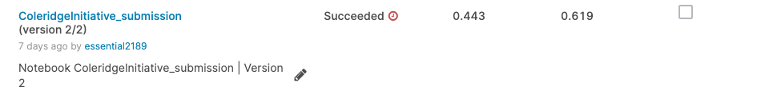
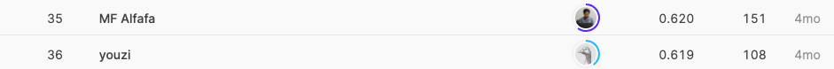

## Coleridge Initiative - Show US the Data

------------

### 결과

----------------

### 요약정보

* 도전기관 : 시큐레이어
* 도전자 : 왕승재
* 최종스코어 : 0.619
* 제출일자 : 2021-10-15
* 총 참여 팀 수 : 1610
* 순위 및 비율 : 36 (2.2%)

### 결과화면

----------

### 사용한 방법 & 알고리즘

* 전처리
  * 토큰의 앞뒤를 확인하여 데이터 집합 언급을 추출한다. 선택적 exclusion_phrase 인수는 문자열이 있는 경우 데이터 집합 언급이 반환되지 않는 문자열 목록이다.
  * 토큰이 문장 시작(끝) 부분에 없으면 토큰 오른쪽(왼쪽)에 단어를 추가하고 불용어를 제거.
  * 데이터셋 언급이 적어도 두 단어 이상이고 마지막 단어가 바람직한 단어가 아닌 경우 처리.
  * Hyphens 및 apostrophes를 위한 추가 공간을 제거.
  * SpaCy의 허용된 nlp.max_길이보다 긴 경우 텍스트를 chunk.
  * hi_freq_dataset에서 문자열의 일치 항목을 찾는다.
* Extractor Function : spaCy - sentencizer
  * 처음에 정규 표현식으로 추출하는 것을 고려하던 중 spaCy의 sentencizer의 다용성을 발견하고 이를 활용했다.
  * sentencizer는 단어 앞과 뒤에 나타나는 토큰을 쉽고 직관적인 방법으로 검사할 수 있으며, 여기에는 토큰의 대/소문자 조합 및 문장 위치를 확인하는 기능이 내장되어 있다.
  * 이러한 추출기 기능을 train dataset에서 실행하고 추출된 dataset 언급의 순위를 문서 빈도에 따라 매기고, 더 높은 문서 빈도의 데이터 세트 언급에 더 중점을 두고 보다 깔끔한 추출을 하도록 함수를 수정함으로써 이러한 추출기 기능을 반복적으로 개발했다.
* spaCy의 작은 영어 모델을 로드하고 sentencizer를 제외한 모든 파이프를 제거. 시드되지 않은 파이프를 상당히 제거하면 실행 시간이 단축된다. 그 후에 테스트 데이터의 모든 ID와 원시 텍스트를 데이터 프레임에 로드하고 데이터 집합 추출기를 각 데이터 프레임 행의 원시 텍스트에 적용한다.
* Frequency filtering
  * 모든 Extractor Function의 출력을 조합한 후 문서 빈도로 순위를 매기고 상위 95%의 백분위수만 유지한다. 상위 95%를 유지하는 근거는 빈번하지 않은 dataset 언급이 스폰서의 목표에 중요할 가능성이 낮기 때문에 test dataset에 label이 붙을 가능성이 낮기 때문이다.
* 최종 dataset 검색
  * high-frequency dataset 언급 목록은 길이를 줄여서 정렬된다.
  * 각 문서에 대해 정렬된 목록이 반복되어 일치 항목을 X로 바꾼다.
    * 예를 들어 이론적으로 "ADNI"와 "Azheimer's Disease Neuroimaging Initiative(ADNI)"가 모두 목록에 있고 "Azheimer's Device Neuroimaging Initiative(ADNI)"만 문서에 있다면 이 방법은 "ADNI"와 "Azheimer's Device Neuroimaging Initiative(ADNI)" 모두를 예측하는 것을 방지한다.

-------------

### 실험 환경 & 소요 시간

* 실험 환경 : kaggle python nootbook (GPU)
* 소요 시간 : 약 10분

-----------

### 코드

['./Coleridge Initiative - Show US the Data.py'](https://github.com/essential2189/AI_Competitions_2/blob/main/kaggle/Coleridge%20Initiative%20-%20Show%20US%20the%20Data/Coleridge%20Initiative%20-%20Show%20US%20the%20Data.py)

-----------

### 참고자료

[spaCy](https://spacy.io/api/sentencizer)
