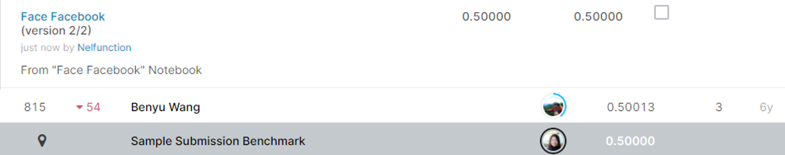

#Facebook Recruiting IV: Human or Robot?

## 결과

### 요약정보

- 도전기관 : 시큐레이어
- 도전자 : 이길상
- 최종스코어 : 0.50
- 제출일자 : 2021-01-06
- 총 참여 팀 수 : 983
- 순위 및 비율 : 816(82.84%)

### 결과화면

## 사용한 방법 & 알고리즘
1. 대회설명:
  
    온라인 경매 사이트에서 고객 만족도 개선과 사용량 감소를 막기 위해 프로그램으로 자동화된 입찰을 막고자 한다. 이번 공모는 '로봇'이 발주하는 온라인 경매 입찰을 파악해 사이트 소유자가 불공정 경매 행위를 막기 위해 이들 이용자를 쉽게 사이트에서 제거하도록 플래그를 다는 것이 목표다.

2. 데이터 설명: 
 
    * train.csv, test.csv : 경매 입찰자에 대한 정보를 담은 훈련/테스트 데이터셋이다.  입찰자 id, 계좌 정보, 주소 정보를 포함한다. 레이블 outcome은 로봇일 확률을 나타내며 0.0은 사람, 1.0은 로봇을 의미한다.
    * bids.csv : 입찰에 대한 데이터셋으로 각기 다른 경매의 7,656,334여 개의 입찰 정보를 가지고 있다. 각 데이터는 입찰 id, 입찰자 id, 경매 이름, 상품 항목, 참여 기기, 시간, 국가, ip, url 정보를 가지고 있다.

3. 알고리즘 설명:

    train 데이터셋 중 robot으로 판명된 비율을 계산하여, 모든 test bidder에 대해 일괄적으로 값을 적용한 뒤 제출하였다.     
## 코드

['./src.py'](./src.py)

## 참고 자료

- 
