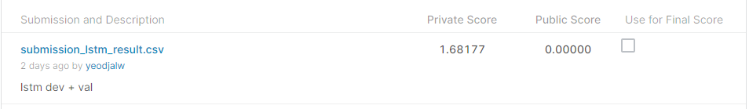
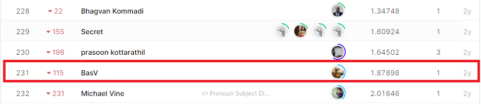

# Gendered Pronoun Resolution
## 결과

### 요약정보

- 도전기관 : 시큐레이어
- 도전자 : 김연진
- 최종스코어 : 1.681777
- 제출일자 : 2021-03-19
- 총 참여 팀 수 : 263
- 순위 및 비율 : 231(87.83%)

### 결과화면

## 사용한 방법 & 알고리즘

- 소문자 변경
- 특수 문자 제거
- 문장 토큰화
- 토큰 인코딩
- BERT 모델로 contextual embedding 생성
- LSTM 모델 사용

## 코드

['./main.py'](./main.py)
['./models.py'](./models.py)
['./mybert.py'](./mybert.py)
['./preprocess.py'](./preprocess.py)

## 참고 자료
