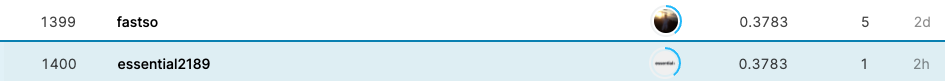

## Google Brain - Ventilator Pressure Prediction

------------

### 결과

----------------

### 요약정보

* 도전기관 : 시큐레이어
* 도전자 : 왕승재
* 최종스코어 : 0.807
* 제출일자 : 2021-09-27
* 총 참여 팀 수 : 2127
* 순위 및 비율 : 1402 (66%)

### 결과화면




----------

### 사용한 방법 & 알고리즘

#### 모델

* MLP

  * 다층 퍼셉트론(multi-layer perceptron, MLP)는 퍼셉트론으로 이루어진 층(layer) 여러 개를 순차적으로 붙여놓은 형태이다.

  * 2 layer MLP를 사용했다.

  * ```python
    input_dim=4,
    lstm_dim=256,
    dense_dim=256,
    logit_dim=256,
    num_classes=1,
    ```

* Bidirectional LSTM
  * 단방향 RNN은 정보의 불균형이 생길 수 밖에 없는 구조이기 때문에 이러한 구조적 문제점을 해결하기 위해 사용.
  * Bidirectional RNN은 2개의 hidden layer를 가지고 있다.
  * 전방향 상태(Forward States)정보를 가지고 있는 hidden layer와 후방향 상태(Backward States) 정보를 가지고 있는 hidden layer가 있고, 이 둘은 서로 연결되어 있지 않은 구조로 형성되어 있다.
  * 그러나 입력되는 토큰은 이 두 가지 hidden layer에 모두 전달되고 아웃풋 layer은 이 두 가지 hidden layer의 값을 모두 받아서 계산한다.
* Learning Rate Scheduler
  * Learning Rate Scheduler는 미리 학습 일정을 정해두고, 그 일정에 따라 학습률을 조정하는 방법이다. 일반적으로는 warmup이라는 파라미터를 정하고 현재 step이 warmup보다 낮을 경우는 learning rate를 linear하게 증가 시키고, warmup 후에는 각 Lr Scheduler에서 정한 방법대로 learning rate를 update한다.

-------------

### 실험 환경 & 소요 시간

* 실험 환경 : kaggle python nootbook (GPU)
* 소요 시간 : 약 8시간

-----------

### 코드

['./Google Brain - Ventilator Pressure Prediction.py'](https://github.com/essential2189/AI_Competitions_2/blob/main/kaggle/Google%20Brain%20-%20Ventilator%20Pressure%20Prediction/Google%20Brain%20-%20Ventilator%20Pressure%20Prediction.py)

-----------

### 참고자료

[Bidirectional LSTM](https://keras.io/api/layers/recurrent_layers/bidirectional/)

[Learning Rate Scheduler](https://keras.io/api/callbacks/learning_rate_scheduler/)

