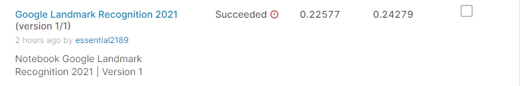
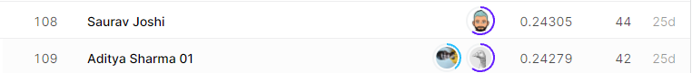
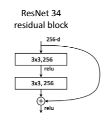

## Google Landmark Recognition 2021

------------

### 결과

----------------

### 요약정보

* 도전기관 : 시큐레이어
* 도전자 : 왕승재
* 최종스코어 : 0.24279
* 제출일자 : 2021-10-26
* 총 참여 팀 수 : 383
* 순위 및 비율 : 109 (28%)

### 결과화면





----------

### 사용한 방법 & 알고리즘

* ResNet34

  * ```python
    ===========================================================================
    Layer (type:depth-idx)                             Param #
    ===========================================================================
    Model                                              --
    ├─TimmBackbone: 1-1                                --
    │    └─ResNet: 2-1                                 --
    │    │    └─Conv2d: 3-1                            9,408
    │    │    └─BatchNorm2d: 3-2                       128
    │    │    └─ReLU: 3-3                              --
    │    │    └─MaxPool2d: 3-4                         --
    │    │    └─Sequential: 3-5                        221,952
    │    │    └─Sequential: 3-6                        1,116,416
    │    │    └─Sequential: 3-7                        6,822,400
    │    │    └─Sequential: 3-8                        13,114,368
    ├─StackHead: 1-2                                   --
    │    └─GeMPool2d: 2-2                              1
    │    └─Sequential: 2-3                             --
    │    │    └─Dropout: 3-9                           --
    │    │    └─Linear: 3-10                           262,144
    │    │    └─BatchNorm1d: 3-11                      1,024
    │    │    └─PReLU: 3-12                            1
    │    │    └─Linear: 3-13                           262,656
    ===========================================================================
    Total params: 21,810,498
    Trainable params: 21,810,498
    Non-trainable params: 0
    ===========================================================================
    ```



-------------

### 실험 환경 & 소요 시간

* 실험 환경 : kaggle python nootbook (GPU)
* 소요 시간 : 약 1시간

-----------

### 코드

['./Google Landmark Recognition 2021.py'](https://github.com/essential2189/AI_Competitions_2/blob/main/kaggle/Google%20Landmark%20Recognition%202021/Google%20Landmark%20Recognition%202021.py)

-----------

### 참고자료

[ResNet](https://arxiv.org/abs/1512.03385)
