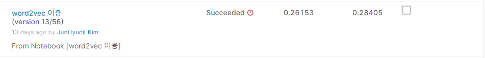
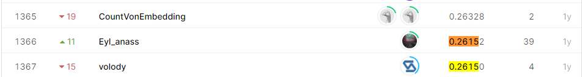

# Google QUEST Q&A Labeling
## 결과

### 요약정보

- 도전기관 : 시큐레이어
- 도전자 : 김준혁
- 최종스코어 : 0.26153 
- 제출일자 : 2021-04-14
- 총 참여 팀 수 : 1572
- 순위 및 비율 : 1366(86%)

### 결과화면

## 사용한 방법 & 알고리즘
- 워드 벡터 사전 생성
  - 소문자 병경
  - 단어 토큰화
  - 단어 벡터화
- 데이터 전처리
  - 단어 인덱스
  - 스퀀스로 변환
  - 패딩
- 인덱스 된 단어를 벡터사전의 벡터값으로 변경
- CNN 모델 학습

## 코드
['./QnACNN.py'](./QnACNN.py)

## 참고 자료
