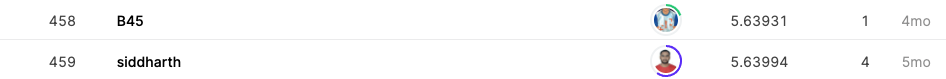

## Google Smartphone Decimeter Challenge

------------

### 결과

----------------

### 요약정보

* 도전기관 : 시큐레이어
* 도전자 : 왕승재
* 최종스코어 : 5.63994
* 제출일자 : 2021-10-20
* 총 참여 팀 수 : 810
* 순위 및 비율 : 459 (56%)

### 결과화면

----------

### 사용한 방법 & 알고리즘

* Kalman Filter
  * Kalman Filter 알고리즘은 2가지 조건이 갖춰진 경우에 사용할 수 있다.
    1. 모션 모델과 측정 모델이 linear할 경우.
    2. 모션 모델과 측정 모델이 Gaussian 분포를 따를 경우.
  * Kalman Filter는 상태 예측(state prediction)과 측정 업데이트(measurement update)를 반복적으로 수행하며 현재 위치를 계산합니다.
* Linear Interpolation
  * 동일한 집합에서 서로 다른 핸드폰 시간에 대해 interpolated 값 생성.
  * Linear Interpolation(선형 보간법)은 1차원 직선상에서 두 점의 값이 주어졌을 때 그 사이의 값을 추정하기 위해 직선 거리에 따라 선형적으로 계산(비례식)하는 방법이다.

-------------

### 실험 환경 & 소요 시간

* 실험 환경 : kaggle python nootbook (GPU)
* 소요 시간 : 약 5분

-----------

### 코드

['./Riiid Answer Correctness Prediction.py'](https://github.com/essential2189/ML_study/blob/main/kaggle/Tabular%20Playground%20Series%20-%20Aug%202021/Tabular%20Playground%20Series%20-%20Aug%202021.py)

-----------

### 참고자료

[Kalman Filter](https://simdkalman.readthedocs.io/en/latest/)

