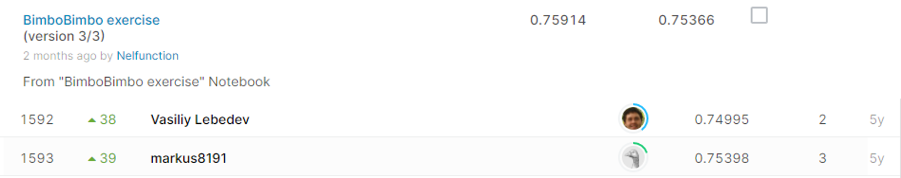

#Grupo Bimbo Inventory Demand

## 결과

### 요약정보

- 도전기관 : 시큐레이어
- 도전자 : 이길상
- 최종스코어 : 0.75366
- 제출일자 : 2021-01-28
- 총 참여 팀 수 : 1,963
- 순위 및 비율 : 1593(81.15%)

### 결과화면

## 사용한 방법 & 알고리즘
1. 대회설명:
  
    식품기업 Grupo Bimbo는 과거 판매 데이터를 기반으로 재고 수요를 정확하게 예측할 수 있는 모델을 개발하여, 판매되지 않은 잉여 제품을 가지고 있는 점주들에게 환불하는 데 드는 비용을 줄이고자 한다.

2. 데이터 설명: 
 
    * train.csv : 74,180,464줄의 훈련용 데이터이며 feature는 다음과 같다.
      * Semana : n주차 번호
      * Agencia_ID : 판매점 id
      * Canal_ID : 판매 채널 id
      * Ruta_SAK : 루트 id
      * Cliente_ID :  고객 id
      * Producto_ID : 제품 id 
      * Venta_uni_hoy : 이번 주 판매량
      * Venta_hoy : 이번 주 판매액
      * Dev_uni_proxima : 이번 주 반품량
      * Dev_proxima : 이번 주 반품액
      * Demanda_uni_equil : 조정된 수요
      
    * test.csv : 테스트 데이터이며 train.csv의 feature에서 Venta_uni_hoy, Venta_hoy,  Dev_uni_proxima, Dev_proxima, Demanda_uni_equil이 빠지고 인덱싱을 위한 id가 추가되어 있다.
    * cliente_tabla.csv : 고객 id에 대응되는 고객의 이름 테이블
    * producto_tabla.csv : 제품 id에 대응되는 제품 이름 테이블
    * town_state.csv : 판매점 id에 해당하는 도시와 주의 이름 목록

3. 알고리즘 설명:

    74,180,464 줄의 데이터 중 첫 5,000,000개 만을 불러와 훈련 데이터로 사용했다. 
    
    선형 회귀, Xgboost 알고리즘을 적용해보고 더 높은 점수가 나온 쪽을 제출했다.     
## 코드

['./src.py'](./src.py)

## 참고 자료

- 
