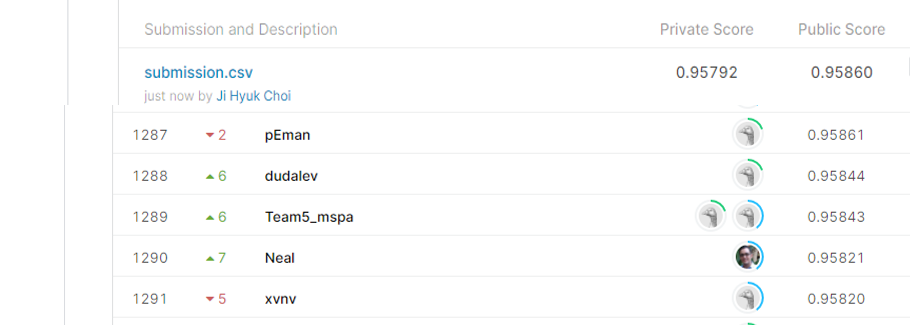

# Homesite Quote Conversion

## 결과

### 요약정보

- 도전기관 : 시큐레이어
- 도전자 : 최지혁
- 최종스코어 : 0.95860
- 제출일자 : 2021-02-26
- 총 참여 팀 수 : 1755
- 순위 및 비율 : 1288(73.39%)

### 결과화면

## 사용한 방법 & 알고리즘
1. 대회설명
보험회사에서 제시하는 주택보험 대회이다. csv파일로 고객이 활동했던 정보를 받으면 그 고객이 구매할 것인지 말것인지(0/1) 예측해야한다.

2. 데이터 설명

train.csv에는quoteNumber(id), Original_Quote_Date(연도/월/일), QuoteConversion_Flag(훈련시 y값), field6~12(6은 str, 나머지는 정수, 실수형), coveragefield, salesField, PersonalField, PropertyField, GeographicField (정수, str)가 들어가있다.
 test.csv는 quoteConversion_Flag만 제외하면 동일하다.

 

3. 알고리즘 설명
1) 날짜를 전처리하여 새로운 피쳐 제작
2) 라벨 인코딩
3) xgboost 이용하여 모델링.

## 코드

['./homesite_quote_conversion.py'](./homesite_quote_conversion.py)

## 참고 자료

- 
