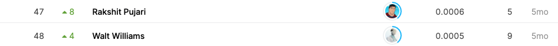

## Hotel-ID to Combat Human Trafficking 2021 - FGVC8

------------

### 결과

----------------

### 요약정보

* 도전기관 : 시큐레이어
* 도전자 : 왕승재
* 최종스코어 : 0.0005
* 제출일자 : 2021-10-25
* 총 참여 팀 수 : 92
* 순위 및 비율 : 48 (52%)

### 결과화면




----------

### 사용한 방법 & 알고리즘

* LabelEncoder

  * 데이터가 범주형이였기 때문에 전처리로 sklearn.preprocessing의 LabelEncoder를 사용해여 수치형으로 변환했다.
  * LabelEncoder는 0과 n_classes-1 사이의 값으로 레이블을 인코딩한다. (여기서 n은 레이블의 수 입니다.)

* ResNet34

  * ```python
    =================================================================
    Layer (type:depth-idx)                   Param #
    =================================================================
    ResNet                                   --
    ├─Conv2d: 1-1                            9,408
    ├─BatchNorm2d: 1-2                       128
    ├─ReLU: 1-3                              --
    ├─MaxPool2d: 1-4                         --
    ├─Sequential: 1-5                        --
    │    └─BasicBlock: 2-1                   --
    │    │    └─Conv2d: 3-1                  36,864
    │    │    └─BatchNorm2d: 3-2             128
    │    │    └─ReLU: 3-3                    --
    │    │    └─Conv2d: 3-4                  36,864
    │    │    └─BatchNorm2d: 3-5             128
    │    └─BasicBlock: 2-2                   --
    │    │    └─Conv2d: 3-6                  36,864
    │    │    └─BatchNorm2d: 3-7             128
    │    │    └─ReLU: 3-8                    --
    │    │    └─Conv2d: 3-9                  36,864
    │    │    └─BatchNorm2d: 3-10            128
    │    └─BasicBlock: 2-3                   --
    │    │    └─Conv2d: 3-11                 36,864
    │    │    └─BatchNorm2d: 3-12            128
    │    │    └─ReLU: 3-13                   --
    │    │    └─Conv2d: 3-14                 36,864
    │    │    └─BatchNorm2d: 3-15            128
    ├─Sequential: 1-6                        --
    │    └─BasicBlock: 2-4                   --
    │    │    └─Conv2d: 3-16                 73,728
    │    │    └─BatchNorm2d: 3-17            256
    │    │    └─ReLU: 3-18                   --
    │    │    └─Conv2d: 3-19                 147,456
    │    │    └─BatchNorm2d: 3-20            256
    │    │    └─Sequential: 3-21             8,448
    │    └─BasicBlock: 2-5                   --
    │    │    └─Conv2d: 3-22                 147,456
    │    │    └─BatchNorm2d: 3-23            256
    │    │    └─ReLU: 3-24                   --
    │    │    └─Conv2d: 3-25                 147,456
    │    │    └─BatchNorm2d: 3-26            256
    │    └─BasicBlock: 2-6                   --
    │    │    └─Conv2d: 3-27                 147,456
    │    │    └─BatchNorm2d: 3-28            256
    │    │    └─ReLU: 3-29                   --
    │    │    └─Conv2d: 3-30                 147,456
    │    │    └─BatchNorm2d: 3-31            256
    │    └─BasicBlock: 2-7                   --
    │    │    └─Conv2d: 3-32                 147,456
    │    │    └─BatchNorm2d: 3-33            256
    │    │    └─ReLU: 3-34                   --
    │    │    └─Conv2d: 3-35                 147,456
    │    │    └─BatchNorm2d: 3-36            256
    ├─Sequential: 1-7                        --
    │    └─BasicBlock: 2-8                   --
    │    │    └─Conv2d: 3-37                 294,912
    │    │    └─BatchNorm2d: 3-38            512
    │    │    └─ReLU: 3-39                   --
    │    │    └─Conv2d: 3-40                 589,824
    │    │    └─BatchNorm2d: 3-41            512
    │    │    └─Sequential: 3-42             33,280
    │    └─BasicBlock: 2-9                   --
    │    │    └─Conv2d: 3-43                 589,824
    │    │    └─BatchNorm2d: 3-44            512
    │    │    └─ReLU: 3-45                   --
    │    │    └─Conv2d: 3-46                 589,824
    │    │    └─BatchNorm2d: 3-47            512
    │    └─BasicBlock: 2-10                  --
    │    │    └─Conv2d: 3-48                 589,824
    │    │    └─BatchNorm2d: 3-49            512
    │    │    └─ReLU: 3-50                   --
    │    │    └─Conv2d: 3-51                 589,824
    │    │    └─BatchNorm2d: 3-52            512
    │    └─BasicBlock: 2-11                  --
    │    │    └─Conv2d: 3-53                 589,824
    │    │    └─BatchNorm2d: 3-54            512
    │    │    └─ReLU: 3-55                   --
    │    │    └─Conv2d: 3-56                 589,824
    │    │    └─BatchNorm2d: 3-57            512
    │    └─BasicBlock: 2-12                  --
    │    │    └─Conv2d: 3-58                 589,824
    │    │    └─BatchNorm2d: 3-59            512
    │    │    └─ReLU: 3-60                   --
    │    │    └─Conv2d: 3-61                 589,824
    │    │    └─BatchNorm2d: 3-62            512
    │    └─BasicBlock: 2-13                  --
    │    │    └─Conv2d: 3-63                 589,824
    │    │    └─BatchNorm2d: 3-64            512
    │    │    └─ReLU: 3-65                   --
    │    │    └─Conv2d: 3-66                 589,824
    │    │    └─BatchNorm2d: 3-67            512
    ├─Sequential: 1-8                        --
    │    └─BasicBlock: 2-14                  --
    │    │    └─Conv2d: 3-68                 1,179,648
    │    │    └─BatchNorm2d: 3-69            1,024
    │    │    └─ReLU: 3-70                   --
    │    │    └─Conv2d: 3-71                 2,359,296
    │    │    └─BatchNorm2d: 3-72            1,024
    │    │    └─Sequential: 3-73             132,096
    │    └─BasicBlock: 2-15                  --
    │    │    └─Conv2d: 3-74                 2,359,296
    │    │    └─BatchNorm2d: 3-75            1,024
    │    │    └─ReLU: 3-76                   --
    │    │    └─Conv2d: 3-77                 2,359,296
    │    │    └─BatchNorm2d: 3-78            1,024
    │    └─BasicBlock: 2-16                  --
    │    │    └─Conv2d: 3-79                 2,359,296
    │    │    └─BatchNorm2d: 3-80            1,024
    │    │    └─ReLU: 3-81                   --
    │    │    └─Conv2d: 3-82                 2,359,296
    │    │    └─BatchNorm2d: 3-83            1,024
    ├─AdaptiveAvgPool2d: 1-9                 --
    ├─Linear: 1-10                           3,986,010
    =================================================================
    Total params: 25,270,682
    Trainable params: 25,270,682
    Non-trainable params: 0
    =================================================================
    ```

  

-------------

### 실험 환경 & 소요 시간

* 실험 환경 : kaggle python nootbook (GPU)
* 소요 시간 : 약 5분

-----------

### 코드

['./Hotel-ID to Combat Human Trafficking 2021 - FGVC8.py'](https://github.com/essential2189/AI_Competitions_2/blob/main/kaggle/Hotel-ID%20to%20Combat%20Human%20Trafficking%202021%20-%20FGVC8/Hotel-ID%20to%20Combat%20Human%20Trafficking%202021%20-%20FGVC8.py)

-----------

### 참고자료

[LabelEncoder](https://scikit-learn.org/stable/modules/generated/sklearn.preprocessing.LabelEncoder.html)

[ResNet](https://pytorch.org/hub/pytorch_vision_resnet/)

