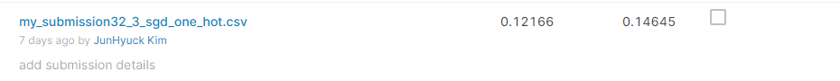
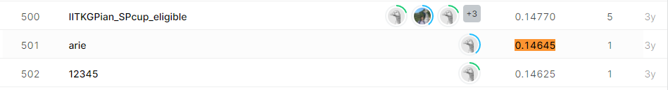

# IEEE's Signal Processing Society - Camera Model Identification
## 결과

### 요약정보

- 도전기관 : 시큐레이어
- 도전자 : 김준혁
- 최종스코어 : 0.14645 
- 제출일자 : 2021-03-26
- 총 참여 팀 수 : 581
- 순위 및 비율 : 501(86%)

### 결과화면

## 사용한 방법 & 알고리즘
- ImageDataGenerator
- CNN 모델 학습

## 코드
['./image_processing.py'](./image_processing.py)
['./image_main.py'](./image_main.py)

## 참고 자료
