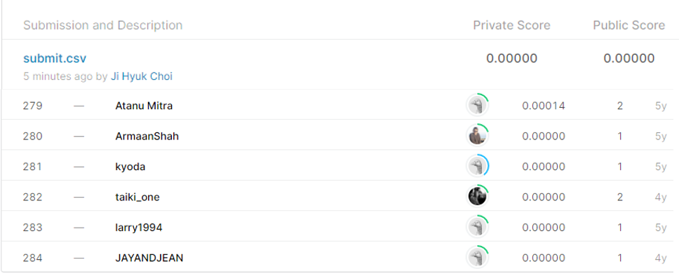

# Integer Sequence Learning

## 결과

### 요약정보

- 도전기관 : 시큐레이어
- 도전자 : 최지혁
- 최종스코어 : 0.0000
- 제출일자 : 2021-02-25
- 총 참여 팀 수 : 284
- 순위 및 비율 : 284(100.00%)

### 결과화면

## 사용한 방법 & 알고리즘
1.	대회설명
 관계없는 정수 수열을 모아 훈련시키고 test.csv의 정수 수열에서 그 다음에 나올 정수 값을 맞추는 대회이다.

2.	데이터 설명
train.csv
 str형: 001 columns
 훈련용 y값: ‘Sequence’ column 속 맨 뒷값
 예측값: int형
test.csv (train.csv와 형태 동일)
 
3. 알고리즘 설명
 전처리: ‘,’로 구분하여 각 정수를 분리하고 저장. linear regression으로 학습하였다.

## 코드

['./integer_sequence_learning.py'](./integer_sequence_learning.py)

## 참고 자료

- 
