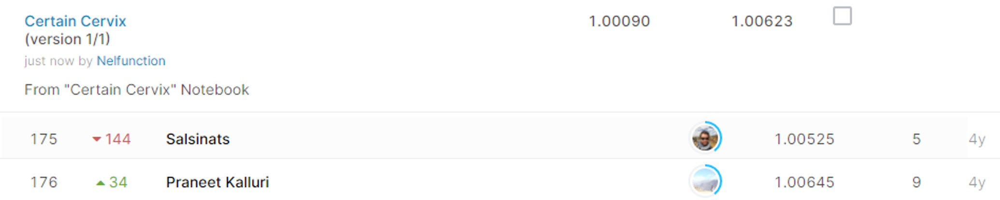

# Intel & MobileODT Cervical Cancer Screening

## 결과

### 요약정보

- 도전기관 : 시큐레이어
- 도전자 : 이길상
- 최종스코어 : 1.00623
- 제출일자 : 2021-01-26
- 총 참여 팀 수 : 848
- 순위 및 비율 : 176(20.75%)

### 결과화면

## 사용한 방법 & 알고리즘
1. 대회설명:
  
    MobileODT는 의료 사업자가 시골 지역에서 더 나은 의학적 결정을 내릴 수 있도록 돕는 원격 감독을 지원하는 품질 보증 워크플로우를 제공한다. 이때 자궁경부암 사진을 활용하여 유형을 정확하게 식별하는 알고리즘을 통해 비효율적인 치료를 방지하고자 한다.

2. 데이터 설명: 
 
    * train.7z :  훈련용 이미지 데이터셋으로, 암 유형에 따라 Type_1, Type_2, Type_3 의 세 폴더에 나뉘어져 있다.
    
    * test.7z : 512개의 사진. 첫 스테이지의 테스트 데이터셋이다.
    
    * additional_Type_{x}.7z : 모델 훈련에 쓸 수 있는 추가 이미지 데이터이다. train.7z와 같이 유형별로 나뉘어져 있다.
    
    * test_stg2.7z : 두번째 스테이지의 테스트 데이터셋이다. 3506개의 이미지가 추가된다.

3. 알고리즘 설명:

    첫번째와 두번째 스테이지의 유형별 이미지 개수를 구하고, 전체 이미지 수에 대한 비율을 구한다. 
    그 값을 각 유형에 대한 확률로 일괄 적용하여 제출하였다.
## 코드

['./src.py'](./src.py)

## 참고 자료

- 
