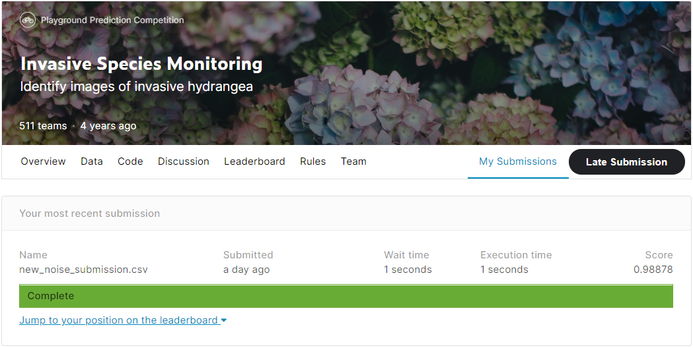
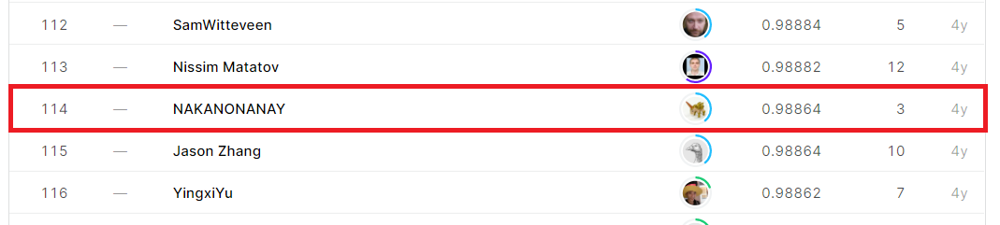

# Invasive Species Monitoring
## 결과

### 요약정보

- 도전기관 : 시큐레이어
- 도전자 : 김연진
- 최종스코어 : 0.98878
- 제출일자 : 2021-03-12
- 총 참여 팀 수 : 511
- 순위 및 비율 : 114(22.30%)

### 결과화면

## 사용한 방법 & 알고리즘

- 이미지 transformation ( 회전, 위치 이동, 수평 및 수직 반전 )
- 노이즈 데이터셋 생성 ( speckle, gaussian, s&p )
- 이미지 마스킹으로 작은 크기의 수국 추출
- 이미지 리사이징
- k-fold 교차검증 방식
- pretrained VGG16

## 코드

['./main.py'](./main.py)
['./models.py'](./models.py)
['./detect.py'](./detect.py)
['./preprocess.py'](./preprocess.py)
['./cross_valid.py'](./cross_valid.py)

## 참고 자료
