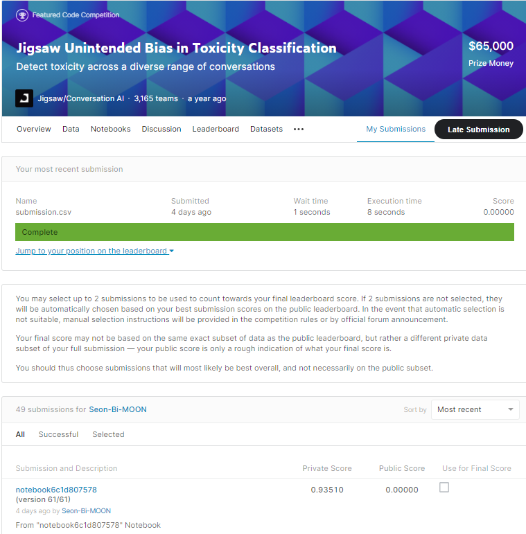

# Jigsaw Unintended Bias in Toxicity Classification

## 결과

### 요약정보

- 도전기관 : 시큐레이어
- 도전자 : 김상현
- 최종스코어 : 0.93510
- 제출일자 : 2021-01-22
- 총 참여 팀 수 : 3165
- 순위 및 비율 : 793(25.00%)

### 결과화면

## 사용한 방법 & 알고리즘

다중출력 LSTM 모델을 사용하였습니다.

- Feature engineering
  - 소문자변경
  - 불용어 제거
  - 욕설 문자 전처리
  - 특수문자 및 숫자 제거
  - 사전 훈련된 Festtext, glove 활용

## 코드

['./Jigsaw-Unintended-Bias-in-Toxicity-Classification.py'](./ToxicityClassification.py)

## 참고 자료

