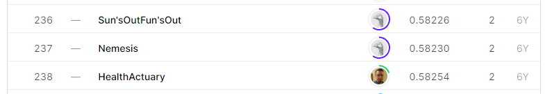

# March Machine Learning Mania 2016
## 결과
### 요약정보
- 도전기관: 한양대학교
- 도전자: 김홍식
- 최종스코어: 0.58230
- 제출일자: 2021-02-26
- 총 참여 팀수: 238
- 순위 및 비율: 39.93%
### 결과화면

## 사용한 방법 & 알고리즘
- Deep Learning
## 코드
https://github.com/WannaBeSuperteur/2020/tree/master/AI/kaggle/2021_02_march_machine_learning_mania_2016