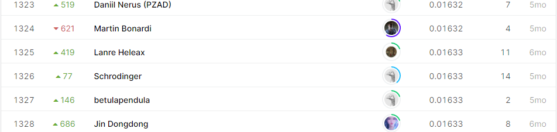

# Mechanisms of Action (MoA) Prediction

## 결과

### 요약정보

- 도전기관 : 한양대학교
- 도전자 : 마지흔
- 최종스코어 : 0.01633
- 제출일자 : 2021-04-19
- 총 참여 팀 수 : 4373
- 순위 및 비율 : 1325(30.30%)

### 결과화면

## 사용한 방법 & 알고리즘

간단한 NN 모델을 사용했습니다.

- 결측값 채우기
- Feature engineering
  - Feature selection
  - PCA
  - VarianceThreshold
- Full connected neural network

## 코드

[`./MoA.ipynb`](./MoA.ipynb)

## 참고 자료
