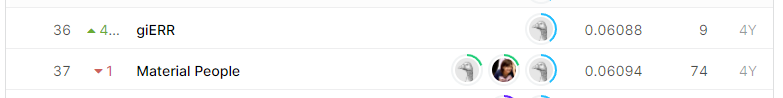

# Nomad2018 Predicting Transparent Conductors
## 결과
### 요약정보
- 도전기관: 한양대학교
- 도전자: 김홍식
- 최종스코어: 0.06090
- 제출일자: 2021-03-15
- 총 참여 팀수: 878
- 순위 및 비율: 4.21%
### 결과화면

## 사용한 방법 & 알고리즘
- Deep Learning
## 코드
https://github.com/WannaBeSuperteur/2020/tree/master/AI/kaggle/2021_03_nomad2018-predict-transparent-conductors