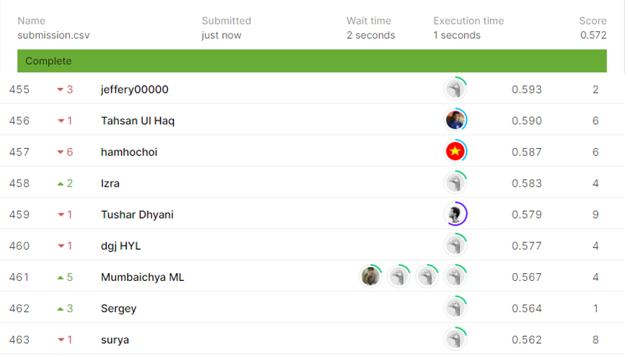

# Northeastern SMILE Lab - Recognizing Faces in the Wild

## 결과

### 요약정보

- 도전기관 : 시큐레이어
- 도전자 : 최지혁
- 최종스코어 : 0.572
- 제출일자 : 2021-02-26
- 총 참여 팀 수 : 522
- 순위 및 비율 : 461(88.31%)

### 결과화면

## 사용한 방법 & 알고리즘

1. 대회설명

2. 데이터 설명
 훈련 데이터 속은 F와 4자리수가 연결된 이름의 폴더로 구분되어있다. F 폴더 하나당 한 가족을 뜻한다. 그  속에 MID로 시작되는 여러 개의 폴더가 존재한다. 각 폴더의 의미는 한 가족(F) 안의 구성원(M)을 뜻하고, MID 폴더 속에는 한 사람의 사진이 복수개 들어가있다.
 모든 사진은 일괄적으로 224*224 사이즈이다.

3. 알고리즘 설명
 전처리과정을 통해 인물의 얼굴 이미지를 가져와서 메트릭스로 변형한 다음 CNN으로 모델을 제작한다.

## 코드

['./northeastern_smile_lab-recognizing_faces_in_the_wild.py'](./northeastern_smile_lab-recognizing_faces_in_the_wild.py)

## 참고 자료

- 
