# Open Images 2019 - Visual Relationship

## 결과

### 요약정보

- 도전기관 : 시큐레이어
- 도전자 : 이길상
- 최종스코어 : 0.00364
- 제출일자 : 2021-01-29
- 총 참여 팀 수 : 200
- 순위 및 비율 : 64(32.00%)

### 결과화면

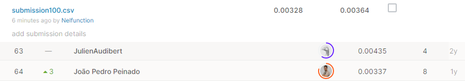

## 사용한 방법 & 알고리즘

* 주제
Open Images Challenge의 일환인 이번 대회는 이미지에서 사물의 탐지 뿐 아니라, 사물관의 상관관계까지 판별하고자 한다. 참여자는 주어진 이미지에서 여러 쌍의 오브젝트를 판별하고, 각 쌍에 해당되는 관계를 탐지하는 것이 목표이다.

* 데이터
kaggle에서 제공되는 것은 test 이미지 데이터셋과 제출 형식을 나타낸 sample submission 뿐이다. train 데이터셋은 Open Images 사이트에서 제공되며, 이번 제출에서는 Kaggle에 유저들이 정리해둔 ‘Open Images 2019 - Visual Relationship Truth’ 데이터셋을 이용하였다. feature는 다음과 같다.
	ImageID : 이미지 파일 이름
	LabelName1, LabelName2 : 이미지에서 발견한 두 오브젝트의 id
	XMin1, XMax1, YMin1, YMax1 : 1번 오브젝트 이미지의 좌표값
	XMin2, XMax2, YMin2, YMax2 : 2번 오브젝트 이미지의 좌표값
	RelationshipLabel : 두 오브젝트의 관계를 나타내는 단어 (is, at ,on, etc)

* 진행 내용 
제출 파일의 목표 레이블 PredictionString은 다음과 같은 문자열이 연속되는 형태이다.
	정확도, 오브젝트 id 1, 좌표 범위 1, 오브젝트 id 2, 좌표 범위 2, 관계
전체 표 데이터에서 LabelName1, LabelName2, RelationshipLabel 의 세가지 feature의 unique 한 조합의 개수를 찾고 높은 순서대로 정렬하였다. 전체 데이터에서 각 조합이 차지하는 비율을 계산하여 정확도로 기록한 뒤, 다른 feature 들과 조합하여 상위 100개의 항목을 PredictionString으로 추가하였다.

## 코드
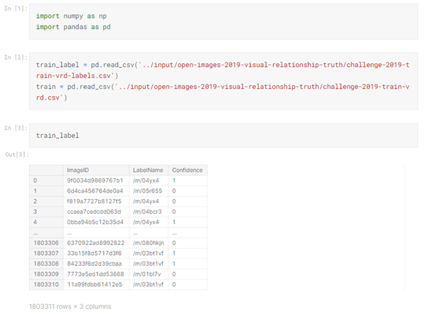
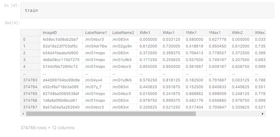
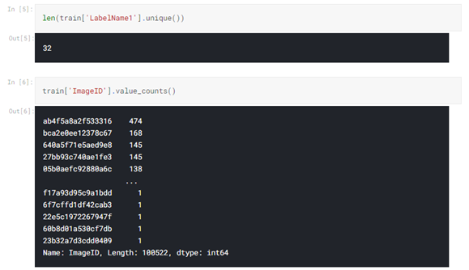
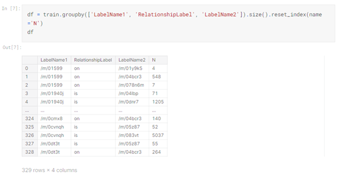
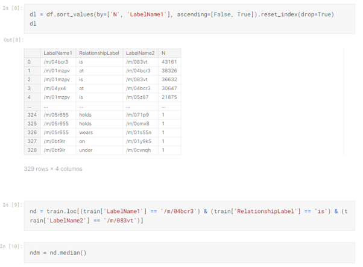
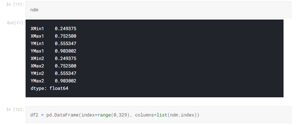
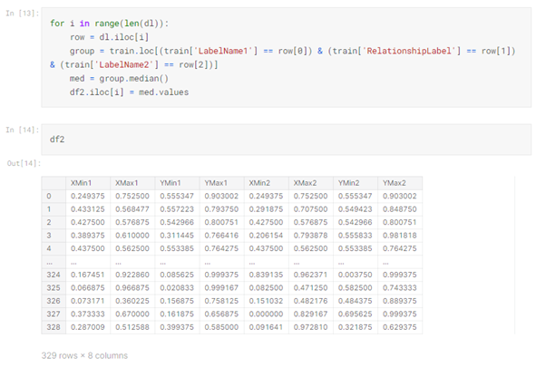
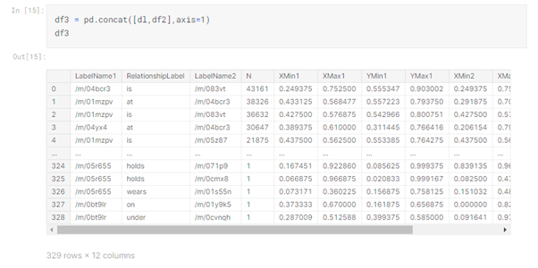
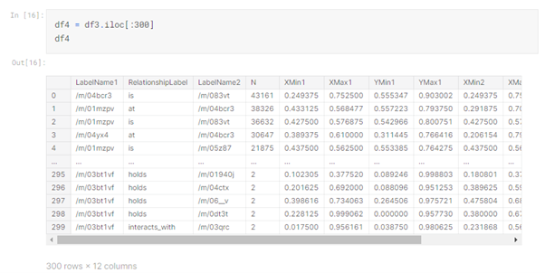

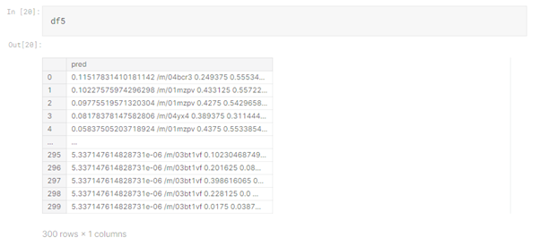
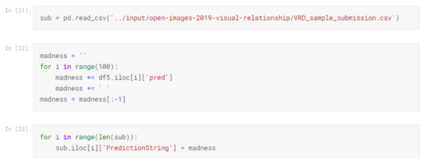
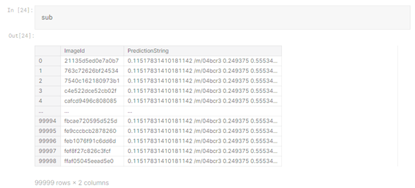
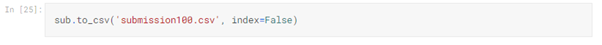

[`./open-operative.ipynb`](./open-operative.ipynb)

## 참고 자료

- 
