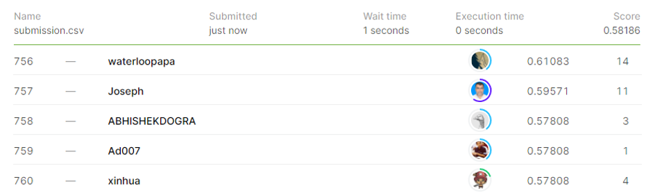

# Plant Seedlings Classification

## 결과

### 요약정보

- 도전기관 : 시큐레이어
- 도전자 : 최지혁
- 최종스코어 : 0.58186
- 제출일자 : 2021-02-26
- 총 참여 팀 수 : 834
- 순위 및 비율 : 758(90.89%)

### 결과화면

## 사용한 방법 & 알고리즘

1. 대회설명
 알후스 대학에서 주최하는 이미지 처리 대회이다. 이미지는 12종류의 식물에 대한 것이고 test셋에서 이미지를 분류해내는 것이 목적이다.

2. 데이터 설명
 train 폴더에는 각 12가지 식물에 대한 이미지가 각 폴더 별로 들어가있다. (총 12폴더) 사진의 크기는 균일하지 못하다.
 test 폴더에는 12가지 식물에 대한 이미지가 섞여 한 폴더에 들어가있다. (총 1폴더)

3. 알고리즘 설명
 먼저 이미지의 크기가 균일하지 못하기 때문에 모든 이미지의 크기를 299*299로 균일하게 맞추어두었다. 그 후에 라벨링 처리를 한 후 xgboost모델로 훈련시켰다.

## 코드

['./plant_seedlings_classification.py'](./plant_seedlings_classification	.py)

## 참고 자료

- 
