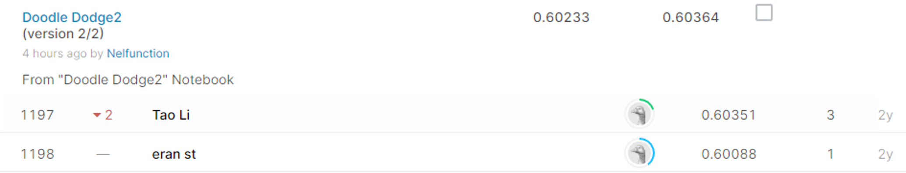

#Quick, Draw! Doodle Recognition Challenge

## 결과

### 요약정보

- 도전기관 : 시큐레이어
- 도전자 : 이길상
- 최종스코어 : 0.60364
- 제출일자 : 2021-01-28
- 총 참여 팀 수 : 1,309
- 순위 및 비율 : 1098(83.88%)

### 결과화면

## 사용한 방법 & 알고리즘
1. 대회설명:
  
    Quick, Draw!는 사용자에게 주어진 특정 주제를 묘사한 이미지를 그리도록 하는 게임이다. 그렇게 만들어진 데이터셋 중 도면이 불완전하거나, 레이블과 일치하지 않는 부분을 걸러내고 이미지에 맞는 레이블을 분류해 낼 수 있는 AI를 만드는 것이 목표이다. 

2. 데이터 설명: 
 
    * test_raw.csv : 사용자의 그림을 그대로 벡터 포맷으로 옮긴 값과, 국가코드, 그림 id값이 포함된 테스트 데이터이다. 
    * test_simplified.csv : raw 벡터에서 필요없는 부분을 덜어내 간소화된 테스트 데이터이다.
    * train_raw.zip : 테스트 데이터의 형태에 인식 여부, 타임스탬프, 분류된 레이블이 추가된 훈련 데이터이다. 
    * train_simplified.zip : raw 벡터에서 필요없는 부분을 덜어내 간소화된 훈련 데이터이다 

3. 알고리즘 설명:

    벡터 형태로 되어있는 데이터를 PIL 라이브러리를 사용하여 이미지로 변환하여 처리했다. 총 340 종류의 그림에서 각 분류당 2천개씩 추출하여 학습 데이터로 사용하였고, 이때 recognized 값이 False인 것을 제외하여 잘못된 값을 학습하는 것을 방지하였다. 학습 모델은 두 개의 컨볼루션 레이어를 포함한 모델을 사용하였다.     
## 코드

['./src.py'](./src.py)

## 참고 자료

- 
