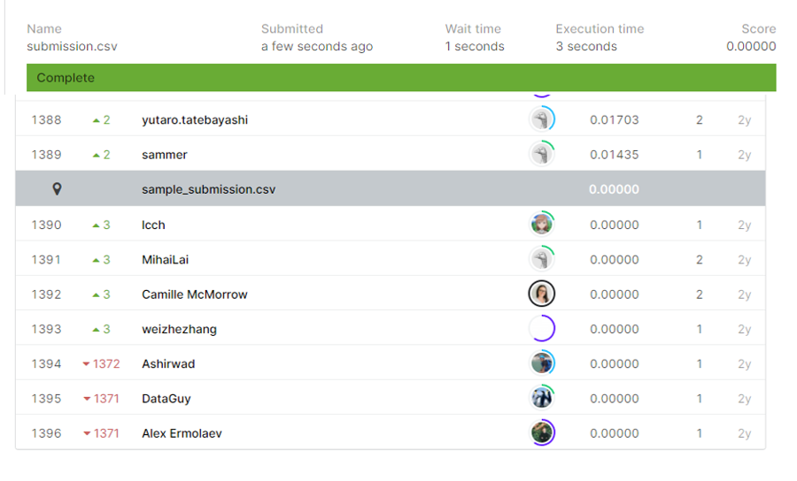

# Quora Insincere Questions Classification

## 결과

### 요약정보

- 도전기관 : 시큐레이어
- 도전자 : 최지혁
- 최종스코어 : 0.00
- 제출일자 : 2021-02-26
- 총 참여 팀 수 : 1396
- 순위 및 비율 : 1390(100.00%)

### 결과화면

## 사용한 방법 & 알고리즘
1. 대회설명
 quora라는 회사에서는 질문으로 들어오는 것들 중 무엇이 sincere하고 무엇이 insincere한지 구별하고 싶어한다.
문장으로 이루어진 str을 x값으로 주고 sincere/insincere y값 ( boolean)을 주어 테스트에서는 str을 읽고 sincere한지 insincere한지를 확인한다.

2.데이터 설명
train.csv-
 question_text: str형.
 target: int (0 또는 1) 형태.
 

test.csv에서는 target만 제외된 상태.

3.	알고리즘 설명

먼저 문장(여러 단어로 이루어진 str)으로 이루어져있으니 각 단어로 나눠 토큰화를 진행한다. 또한 문장마다 길이 차이가 있으므로 pad_sequences를 이용하여 일정한 길이로 맞추어준다. 학습 모델은 LSTM을 기반으로 한다.

(대회 특성상 부득이하게 kaggle notebook으로 제출하여야하는데, 코드를 대부분 로컬해서 하여 notebook으로 제출하기 위해 부득이하게 만든 것이 아래의 캐글버전입니다. local computer의 코드를 실행하면 결과가 0.5를 넘지를 못하여 0또는 1로 답해야하는 위 문제의 특성 상, 답으로 모두 0이 들어가므로 결과적인 등수는 로컬 컴퓨터 코드와 캐글 노트북 코드가 동일합니다..)

## 코드

['./quora_insincere_questions_classification.py'](./quora_insincere_questions_classification.py)

## 참고 자료

- 
