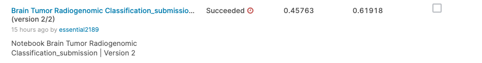
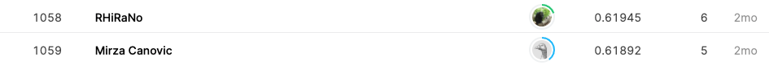

## RSNA-MICCAI Brain Tumor Radiogenomic Classification

------------

### 결과

----------------

### 요약정보

* 도전기관 : 시큐레이어
* 도전자 : 왕승재
* 최종스코어 : 0.61918
* 제출일자 : 2021-10-20
* 총 참여 팀 수 : 1555
* 순위 및 비율 : 1059 (68%)

### 결과화면





----------

### 사용한 방법 & 알고리즘

* CNN 모델

  * ```python
    _________________________________________________________________
    Layer (type)                 Output Shape              Param #   
    =================================================================
    input_1 (InputLayer)         [(None, 32, 32, 1)]       0         
    _________________________________________________________________
    rescaling (Rescaling)        (None, 32, 32, 1)         0         
    _________________________________________________________________
    Conv_1 (Conv2D)              (None, 29, 29, 64)        1088      
    _________________________________________________________________
    max_pooling2d (MaxPooling2D) (None, 14, 14, 64)        0         
    _________________________________________________________________
    Conv_2 (Conv2D)              (None, 13, 13, 32)        8224      
    _________________________________________________________________
    max_pooling2d_1 (MaxPooling2 (None, 13, 13, 32)        0         
    _________________________________________________________________
    dropout (Dropout)            (None, 13, 13, 32)        0         
    _________________________________________________________________
    flatten (Flatten)            (None, 5408)              0         
    _________________________________________________________________
    dense (Dense)                (None, 32)                173088    
    _________________________________________________________________
    dense_1 (Dense)              (None, 2)                 66        
    =================================================================
    Total params: 182,466
    Trainable params: 182,466
    Non-trainable params: 0
    _________________________________________________________________
    ```

* ExpenentialDecay Learning Rate Schedule
  * 섬세한 모델 튜닝을 위해서는 learning rate를 조금씩 줄여주는 작업이 필요하다. 특정 iteration마다 optimizer instance를 새로 생성해줘도 되지만, tensorflow에서는 optimizer의 learning rate scheduling이 가능하다.
  * ExponentialDecay는 계속 같은 비율로 learning rate를 감소시켜준다.
  * staircase=True는 learning rate를 계단식으로 감소시켜준다. 즉 decay_steps에 도달하기 전에는 learning rate를 유지시키다가, decay_steps가 넘어가면 그 때 학습률을 감소시키는 것이다.
* Early Stopping
  * `val_roc_auc` 을 모니터링해 조건에 달하면 Early Stop해 학습시간을 줄였다.
* OpenCV
  * 오픈 소스 컴퓨터 비전 라이브러리 중 하나로 크로스플랫폼과 실시간 이미지 프로세싱에 중점을 둔 라이브러리이다.
  * 이미지 전처리를 위해 사용했다.

-------------

### 실험 환경 & 소요 시간

* 실험 환경 : kaggle python nootbook (GPU)
* 소요 시간 : 약 5분

-----------

### 코드

['./RSNA-MICCAI Brain Tumor Radiogenomic Classification.py'](https://github.com/essential2189/AI_Competitions_2/blob/main/kaggle/RSNA-MICCAI%20Brain%20Tumor%20Radiogenomic%20Classification/RSNA-MICCAI%20Brain%20Tumor%20Radiogenomic%20Classification.py)

-----------

### 참고자료
[OpenCV](https://opencv.org/)
