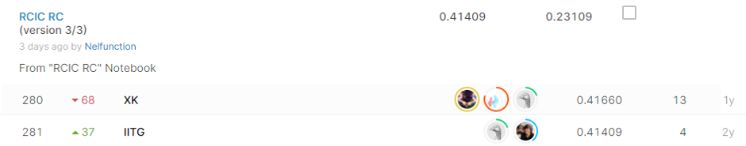

# Recursion Cellular Image Classification

## 결과

### 요약정보

- 도전기관 : 시큐레이어
- 도전자 : 이길상
- 최종스코어 : 0.41409
- 제출일자 : 2021-01-13
- 총 참여 팀 수 : 865
- 순위 및 비율 : 281(32.45%)

### 결과화면

## 사용한 방법 & 알고리즘

* 주제
Recursion 제약사에서는 약물과 세포의 상호작용에 대한 AI연구를 위해 자동화된 분류 과정을 도입하고자 한다. 세포의 사진을 분석하여 총 1,108 종 중 하나인 siRNA 번호를 식별해 내는 것이 목표이다.

* 데이터
[train/test].zip: 훈련 및 예측용 이미지 데이터이다. 이미지 파일의 path와 이름은 이미지와 관련된 표 데이터의 값과 연관되어 있다. 
예) U2OS-01/Plate1/B02_s2_w3.png
  experiment (U2OS batch 1)
  plate (1)
  well (column B, row 2)
[train/test].csv: 각 이미지에 대한 데이터를 담은 표 이미지이다.
  experiment: 세포 타입과 배치 번호
  plate: 실험에서 배정된 플레이트 번호(1~4)
  well: 플레이트에서의 위치(277종류)
  sirna: siRNA 식별번호

* 진행 내용 
실험은 일정 규칙을 가지고 이루어졌고, 데이터는 다음과 같은 특성을 가지고 있었다.
  	4개의 플레이트별로 277개의 접시 존재
  	1108종의 siRNA는 각 실험마다 최대 하나
  	siRNA는 277개씩 플레이트로 나뉘며 그룹 단위로 교체됨
플레이트는 총 4종이므로 각 그룹이 배치되는 경우의 수는 24이지만, 실제로는 적은 경우의 로테이션을 가지고 있었고, train 데이터는 3가지의 경우만을 가지고 있었다. 
Keras Densenet을 사용하여 학습한 공개 데이터의 결과를 확인해 보았을 때는 총 4종류의 로테이션이 존재했고, 각 실험에서의 그룹 배치 확률을 계산하여 이를 기반으로 submission값을 업데이트 하였다. 

## 코드

['./rcic-rc.ipynb'](./rcic-rc.ipynb)
['./recursion-cellular-keras-densenet.ipynb'](./recursion-cellular-keras-densenet.ipynb)
## 참고 자료

- 
