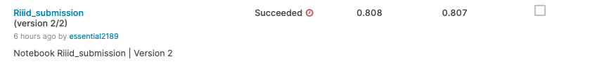
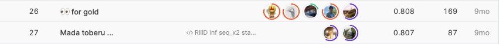
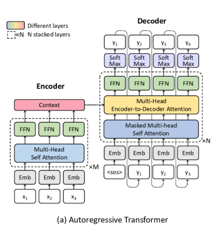

## Riiid Answer Correctness Prediction

------------

### 결과

----------------

### 요약정보

* 도전기관 : 시큐레이어
* 도전자 : 왕승재
* 최종스코어 : 0.807
* 제출일자 : 2021-09-27
* 총 참여 팀 수 : 3395
* 순위 및 비율 : 27 (0.8%)

### 결과화면

----------

### 사용한 방법 & 알고리즘

#### 모델

* Autoregressive Transformer
  * 오리지널 Transformer Model의 decoder를 사용하며, 이전 모든 토큰들에 대해 다음 토큰을 예측하는 방식으로 사전 학습 된다. Transformer Attention에서 다음 문장을 예측할때, 전체 문장의 윗부분을 마스킹 처리하여,  Attention Head가 예측하고자 하는 다음 토큰 이전까지만 볼 수 있도록 한다. 대표적인 모델로는 GPT 모델이 있으며, 대표적인 예로는 텍스트 생성 태스크가 있다.
    * `Dimensional Embeddings - 512`
    * `Heads - 8`
    * `layers - 6`
    * `No Positional Encoding`
    * Input layer에 (sum으로) 적용된 Embeddings

* 최대 Sequence 길이는 512 입니다. 그러나 이 Sequence에서 각 질문은 2가지 포지션을 사용합니다.
  	1. 미래에서 온 정보를 포함하지 않은 Prediction (Prediction을 위해 정보를 유출하지 않음)
   	2. Prediction에 영향을 미치지 않지만(이전 위치에서 수행되었으므로) 다음 질문에도 사용할 수 있는 동일한 질문 답변 결과의 Embedding + Embedding 입니다. (학습을 진행할때 동일한 번들 질문이 동일한 번들로부터 이전 질문의 결과에 액세스 할 수 있기 때문에 향후 마스킹 문제를 올바르게 해결하면 점수는 향상될 수 있을 것으로 기대됩니다.)

-------------

### 실험 환경 & 소요 시간

* 실험 환경 : kaggle python nootbook (GPU)
* 소요 시간 : 약 6시간

-----------

### 코드

['./Riiid Answer Correctness Prediction.py'](https://github.com/essential2189/AI_Competitions_2/blob/main/kaggle/Riiid%20Answer%20Correctness%20Prediction/Riiid%20Answer%20Correctness%20Prediction.py)

-----------

### 참고자료

[Attention Is All You Need](https://arxiv.org/abs/1706.03762)

[Transformer Models](https://huggingface.co/docs/transformers/model_summary)

