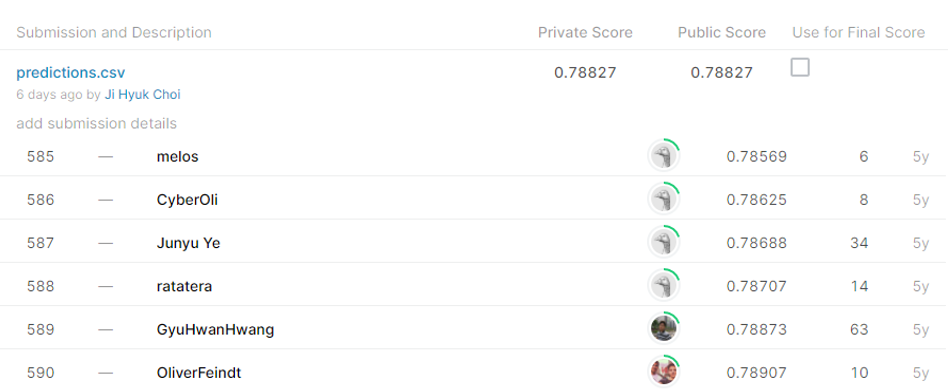

# shelter animal outcomes

## 결과

### 요약정보

- 도전기관 : 시큐레이어
- 도전자 : 최지혁
- 최종스코어 : 0.78827
- 제출일자 : 2021-02-19
- 총 참여 팀 수 : 1601
- 순위 및 비율 : 589(36.79%)

### 결과화면

## 사용한 방법 & 알고리즘
1. 대회설명
 -동물보호소에서 많은 동물들을 제대로 돌보지 못하는 문제가 있다. 입양이 잘 되는 부류와 안 되는 부류를 구분하여 안되는 부류에 더 신경을 쓰고자 한다.
 -결과에 대한 다섯가지 클래스가 있어 각 클래스로 결과가 나올 확률을 구한다.

2. 데이터 설명
-train.csv: 보호소에 들어온 동물들의 정보 (DateTime은 ‘2014-02-12  6:22:00 PM’ 같이 연도/월/일, 시간/분/초 형식) 
str형: 7 columns
 
-test.csv: train.csv에서 outcomeType, outcomeSubtype만 제외된 형태.
 

3. 알고리즘 설명
각 피쳐별로 유의미한 정보로 나눠 라벨링 전처리.
	kfold와 gridsearch로 파라미터 튜닝.
	RandomForest모델 사용.

## 코드

['./main_shelter_animal_outcomes.py'](./main_shelter_animal_outcomes.py)

## 참고 자료

- 
