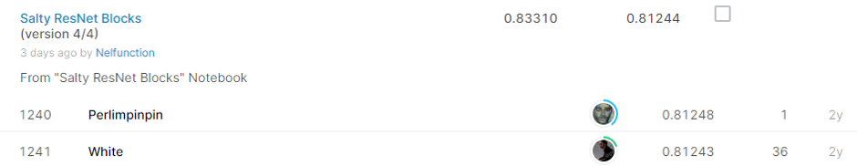

# TGS Salt Identification Challenge

## 결과

### 요약정보

- 도전기관 : 시큐레이어
- 도전자 : 이길상
- 최종스코어 : 0.81244
- 제출일자 : 2021-01-20
- 총 참여 팀 수 : 3,219
- 순위 및 비율 : 1,241(38.55%)

### 결과화면

## 사용한 방법 & 알고리즘

* 주제
지구과학 데이터 기업 TGS는 지표면 아래 지질이 소금인지 여부를 알고 싶어한다. 전문적인 지진 영상촬영은 여전히 소금체에 대한 전문적인 인간 해석이 필요하다. 이 부분을 알고리즘의 힘을 빌려 자동으로 정확하게 식별하는 것이 목표이다.

* 데이터
train.csv : 이미지 파일의 이름과, 소금이 있는 부분을 나타낸 마스크를 RLE 값으로 나타낸 표 데이터이다.
train.zip :  훈련용 이미지 데이터셋으로, 흑백으로 된 지질 이미지와 소금이 있는 부분을 나타낸 마스크 이미지로 나뉘어 있다. 이미지는 101*101 크기이며, 각 픽셀은 소금이 있거나, 혹은 없거나 두가지의 상태를 가진다.
test.zip : 테스트 이미지 데이터셋. 흑백으로 된 지질 이미지만 포함되어 있다.
depths.csv : 각 사진이 촬영한 지질의 깊이 데이터.

* 진행 내용 
마스크 이미지를 활용하여 각 이미지별로 소금이 있는 정도를 계산하여 ‘Coverage’로, 이 값을 10단계로 나누어 ‘Coverage class’로 두 개의 Feature를 추가하였다. 이렇게 새로 추가한 Feature를 사용하여 그 분포를 유지한 채로 데이터셋을 테스트 스플릿으로 분할하여 학습하였다. 학습 모델은 Residual Block을 사용한 Unet 구조를 사용하였다.

## 코드

['./salty-salute2.ipynb'](./salty-salute2.ipynb)

## 참고 자료

- 
