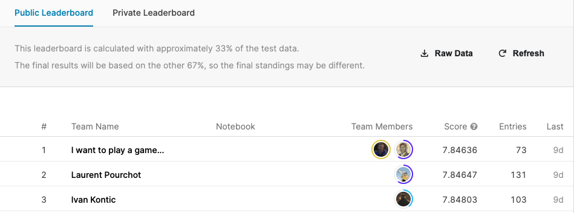
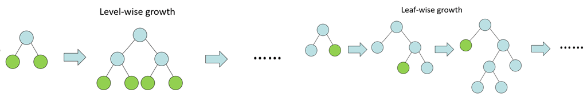

## Tabular Playground Series - Aug 2021

------------

### 결과

----------------

### 요약정보

* 도전기관 : 시큐레이어
* 도전자 : 왕승재
* 최종스코어 : 7.88759
* 제출일자 : 2021-09-09
* 총 참여 팀 수 : 1753
* 순위 및 비율 : 1 (0%)

### 결과화면

----------

### 사용한 방법 & 알고리즘

* LightAutoML

  * 자동화된 기계 학습을 목적으로 하는 오픈 소스 파이썬 라이브러리.
  * Tabular, text data에 대해 가볍고 효율적이도록 설계됐다.

* Gradient Boosting

  * Weak learner를 loss function상에서 gradient descent라는 최적화 기법으로 기울기가 가장 큰(greedy procedure) 방향으로 sub tree들을 반복적으로 추가하여 결합하는 방법으로 성능을 향상시키는 boosting 기법중 하나이다.

* LGBM(Light Gradient Boosting Machine)

  * Gradient Boosting Framework로 Tree기반 학습 알고리즘.

  * 잔여오차(residual error)에 가중치를 gradient descent로 진행한다.

  * 다른 알고리즘은 level-wise인 반면 LGBM은 leaf-wise이다.

    

  * leaf-wise의 장점은 속도가 빠르다는 것이 가장 큰 장점입니다. Light GBM은 큰 사이즈의 데이타를 다룰 수 있고 실행시킬 때 적은 메모리를 차지합니다. 

* Catboost

  * level-wise 방식.
  * Ordering Principle의 개념을 대입하여 기존의 data-leakage로 인한 prediction-shift에 대한 문제 그리고 high cardinality를 가진 category 변수에 대한 전처리 문제를 해결함으로서 다른 gbm 알고리즘보다 좋은 성능을 낸다.

-------------

### 실험 환경 & 소요 시간

* 실험 환경 : kaggle python nootbook (GPU)
* 소요 시간 : 약 1시간 20분

-----------

### 코드

['./Tabular Playground Series - Aug 2021.py'](https://github.com/essential2189/AI_Competitions_2/blob/main/kaggle/Tabular%20Playground%20Series%20-%20Aug%202021/Tabular%20Playground%20Series%20-%20Aug%202021.py)

-----------

### 참고자료

[LightAutoML](https://lightautoml.readthedocs.io/en/latest/)

[LGBM](https://github.com/microsoft/LightGBM)

[CatBoost](https://github.com/catboost/catboost)

[leaf-wise, level-wise](https://datascience.stackexchange.com/questions/26699/decision-trees-leaf-wise-best-first-and-level-wise-tree-traverse)

