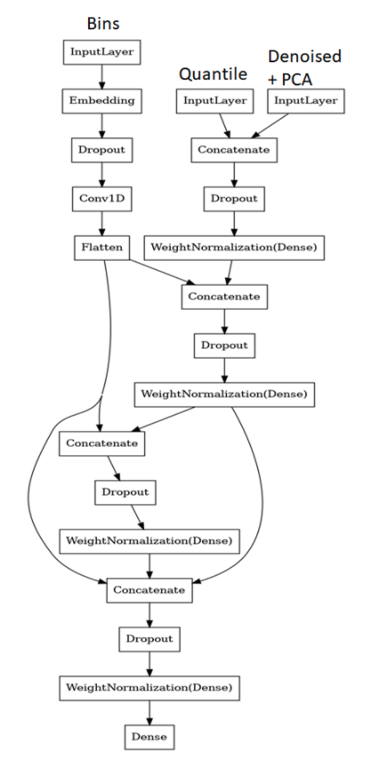

## Tabular Playground Series - Aug 2021

------------

### 결과

----------------

### 요약정보

* 도전기관 : 시큐레이어
* 도전자 : 왕승재
* 최종스코어 : 7.86560
* 제출일자 : 2021-09-09
* 총 참여 팀 수 : 1753
* 순위 및 비율 : 302 (17%)

### 결과화면

----------

### 사용한 방법 & 알고리즘

#### 전처리

* Quantile Normalization
  * Quantile Normalization은 비교하려는 data들의 분포를 동일하게 만들고 싶을 때, 또는 기준이 되는 분포가 있는 경우 데이터들의 분포를 모두 기준 분포와 동일하게 만들고 싶을 때 사용할 수 있다.
  * Data set 각 column의 noise가 심해서 분포가 크게 달랐기 때문에 Quantile 방법을 통해 정규화를 진행했다.
* Denoising Auto-Encoder(DAE)
  * Auto-Encoder가 의미 있는 feature를 학습하도록 제약을 주는 방법.
  * input data에 noise를 추가하고, noise가 없는 원본 data를 재구성하도록 학습시킨다.
  * noise는 input data에 'Gaussian noise'를 추가하거나, Dropout처럼 랜덤하게 노드를 drop해서 발생 시킬 수 있다.
* Bins
  * Bins을 기반으로 동일한 크기의 buckets으로 feature 변환.

#### 모델

* 3 Input Branches :
  1. 100개의 quantile normalized features.
  2. 100개의 encoded features 및 상위 10개 principal components analysis(PCA).
  3. 100개의 binned features.
* 2 middle blocks :
  1. quantile normalized + encoded features에 대한 feed-forward block.
  2. binned features에 대한 convolutional block.

-------------

### 실험 환경 & 소요 시간

* 실험 환경 : kaggle python nootbook (GPU)
* 소요 시간 : 약 1시간 20분

-----------

### 코드

['./Tabular Playground Series - Aug 2021.py'](https://github.com/essential2189/ML_study/blob/main/kaggle/Tabular%20Playground%20Series%20-%20Aug%202021/Tabular%20Playground%20Series%20-%20Aug%202021.py)

-----------

### 참고자료

[Quantile Normalization](https://en.wikipedia.org/wiki/Quantile_normalization)

[Denoising Auto-Encoder](https://blog.keras.io/building-autoencoders-in-keras.html)

[Histogram Bins](https://en.wikipedia.org/wiki/Histogram)

