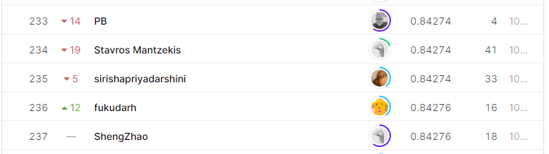

# Tabular Playground Series - Feb 2021
## 결과
### 요약정보
- 도전기관: 한양대학교
- 도전자: 김홍식
- 최종스코어: 0.84274
- 제출일자: 2021-03-31
- 총 참여 팀수: 1433
- 순위 및 비율: 16.47%
### 결과화면

## 사용한 방법 & 알고리즘
- lightGBM with parameters:
params = {'learning_rate': 0.01,
              'subsample': 0.8,
              'colsample_bytree': 0.21,
              'reg_lambda': 11,
              'reg_alpha': 17,
              'min_child_samples': 31,
              'max_depth': 16,
              'boosting': 'gbdt',
              'objective': 'regression',
              'metric': 'rmse',
              'is_training_metric': True,
              'num_leaves': 64,
              'max_bin': 512,
              'cat_smooth': 80,
              'cat_l2': 0.03,
              'bagging_freq': 3,
              'seed': None}
## 코드
https://github.com/WannaBeSuperteur/2020/tree/master/AI/kaggle/2021_03_tabular_playground_series_feb_2021