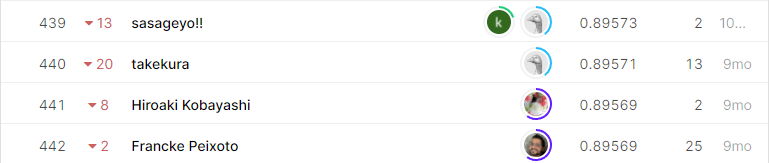

# Tabular Playground Series - Mar 2021
## 결과
### 요약정보
- 도전기관: 한양대학교
- 도전자: 김홍식
- 최종스코어: 0.89571
- 제출일자: 2021-04-07
- 총 참여 팀수: 1495
- 순위 및 비율: 29.50%
### 결과화면

## 사용한 방법 & 알고리즘
- lightGBM with parameters:
params = {'resample': None,
              'power': False,
              'boosting_type': 'gbdt',
              'num_leaves': 200,
              'min_child_samples': 32,
              'max_depth': 16,
              'max_delta_step': 8,
              'reg_alpha': 0.086,
              'reg_lambda': 9.52,
              'colsample_bytree': 0.35,
              'cat_smooth': 82,
              'cat_l2': 12}
## 코드
https://github.com/WannaBeSuperteur/2020/tree/master/AI/kaggle/2021_04_tabular_playground_series_mar