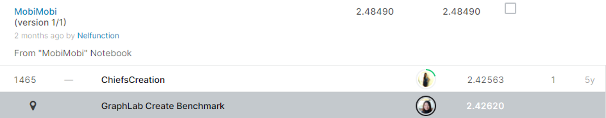

#TalkingData Mobile User Demographics

## 결과

### 요약정보

- 도전기관 : 시큐레이어
- 도전자 : 이길상
- 최종스코어 : 2.48490
- 제출일자 : 2021-01-28
- 총 참여 팀 수 : 1,680
- 순위 및 비율 : 1466(87.26%)

### 결과화면

## 사용한 방법 & 알고리즘
1. 대회설명:
  
    모바일 데이터 플랫폼인 TalkingData에서 사용자 및 선호도에 따라 조정되는 데이터 중심 마케팅 활동을 추진하기 위해 앱 사용, 지리적 위치, 모바일 기기 특성을 바탕으로 사용자의 인구학적 특성(성별과 연령)을 예측하는 모델을 구축하고자 한다. 

2. 데이터 설명: 
 
    * ender_age_train.csv : 제품 id(device_id), 성별, 나이, 속한 통계상의 집단(group, 성별-연령대)을 feature로 가지는 훈련용 데이터셋이다. 74,645줄의 데이터로 이루어져 있다.
    * gender_age_test.csv : 예측용 데이터셋 이며 오직 112,071개의 device_id 항목만 존재한다. 성별-연령대를 나타내는 group 라벨을 예측해야 한다.
    * events.csv, app_events.csv : 사용자가 TalkingData SDK를 사용할 때 생기는 이벤트 로그 데이터이다. 각 이벤트는 이벤트 id와 위치정보를 가지며 app_events의 앱 목록에 대응된다. 
    * app_labels.csv, label_categories.csv :  앱 이름과 해당되는 레이블 id, 문자열로 된 카테고리. 
    * phone_brand_device_model.csv : 라벨 device id에 해당되는 제품 브랜드와 이름을 포함하고 있다. 브랜드명은 중국 한자로 적혀 있다.
 
3. 알고리즘 설명:

    샘플 submission 제출     
## 코드

['./src.py'](./src.py)

## 참고 자료

- 
