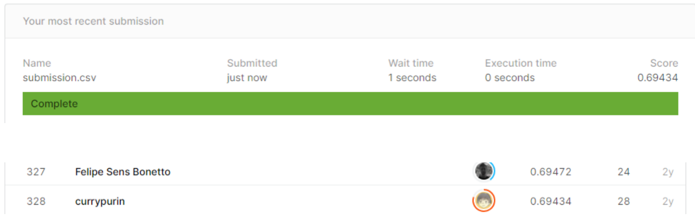

# VSB Power Line Fault Detection

## 결과

### 요약정보

- 도전기관 : 한양대학교
- 도전자 : 왕격
- 최종스코어 : 0.69434
- 제출일자 : 2021-03-18
- 총 참여 팀 수 : 1445
- 순위 및 비율 : 328(22.70%)

### 결과화면

## 사용한 방법 & 알고리즘

BiLSTM모델을 사용했습니다.

- 결측값 채우기
- Feature engineering
  - Feature selection
- Attention Layer construction
- BiLSTM model
  - 128nodes
  - 64 nodes
  - 1 output

## 코드

[`./VSB Power Line Fault Detection.py`](./VSB Power Line Fault Detection.py)

## 참고 자료

- [basic feature engineering](https://www.kaggle.com/go1dfish/basic-eda)
