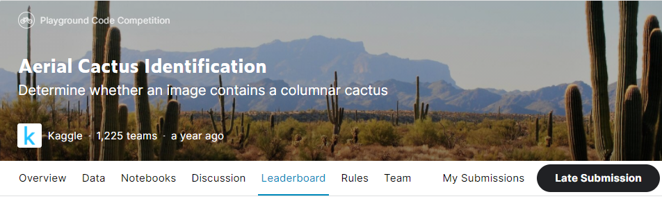
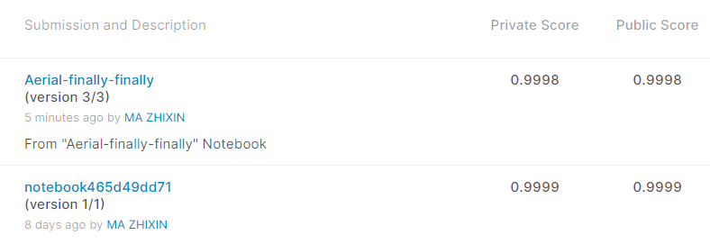
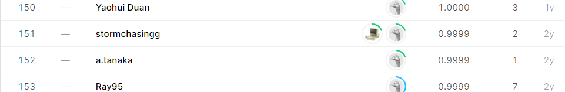

# Aerial Cactus Identification

## 결과

### 요약정보

- 도전기관 : 한양대학교
- 도전자 : 마지흔
- 최종스코어 : 0.9999
- 제출일자 : 2020-11-25
- 총 참여 팀 수 : 1225
- 순위 및 비율 : 151(12.32%)

### 결과화면

## 사용한 방법 & 알고리즘

세가지 네트워크 모델을 사용했습니다.

- Average the prediction results of the three models

## 코드

[`./aerial-challenge.ipynb`](./aerial-challenge.ipynb)

## 참고 자료
