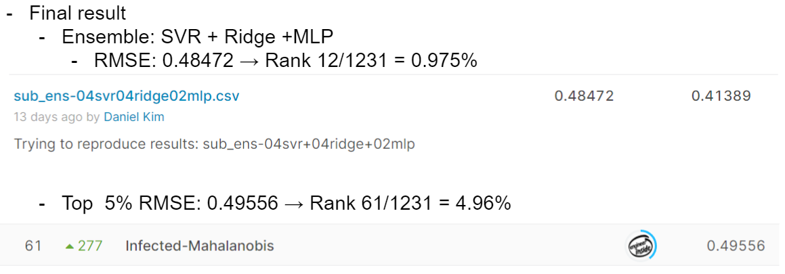

# Africa Soil Property Prediction Challenge
## 결과
### 요약정보
- 도전기관: 한양대학교
- 도전자: 김진훈
- 최종스코어: 0.48472
- 제출일자: 2021-10-06
- 총 참여 팀수: 1231
- 순위 및 비울: 0.975%
### 결과화면

## 사용한 방법 & 알고리즘
- Preprocessing: Use only the spectral features and apply log(P+1) to target P to reduce the skewness
- Ensemble of Sklearn Ridge, Sklearn SVR and tensorflow MLP
## 코드
[`./afsis-soil-properties.ipynb`](./afsis-soil-properties.ipynb)
## 참고 자료
- The code was developed by the author
