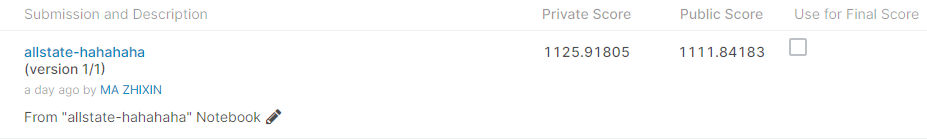
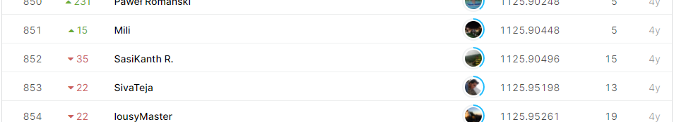

# Allstate Claims Severity

## 결과

### 요약정보

- 도전기관 : 한양대학교
- 도전자 : 마지흔
- 최종스코어 : 1125.91805
- 제출일자 : 2020-12-31
- 총 참여 팀 수 : 3045
- 순위 및 비율 : 852(27.98%)

### 결과화면

## 사용한 방법 & 알고리즘

XGBoost

10 KFold

loss function: MAE

## 코드

[`./allstate-challenge.ipynb`](./allstate-challenge.ipynb)

## 참고 자료
