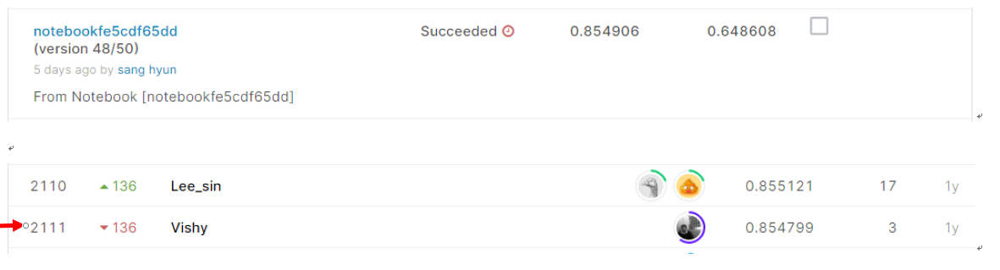

# APTOS 2019 Blindness Detection 

## 결과

### 요약정보

- 도전기관 : 시큐레이어
- 도전자 : 김상현
- 최종스코어 : 0.8549
- 제출일자 : 2021-01-22
- 총 참여 팀 수 : 2928
- 순위 및 비율 : 2111(72.00%)

### 결과화면

## 사용한 방법 & 알고리즘

DenseNet을 사용하였습니다.

- Feature engineering
  - Resize
  - Edge enhance
  - Contrast
  - Brightness
- Data Generation
  - flip
  - zoom

## 코드

['./APTOS-2019-Blindness-Detection.ipynb'](./BlindnessDetection.ipynb)

## 참고 자료

