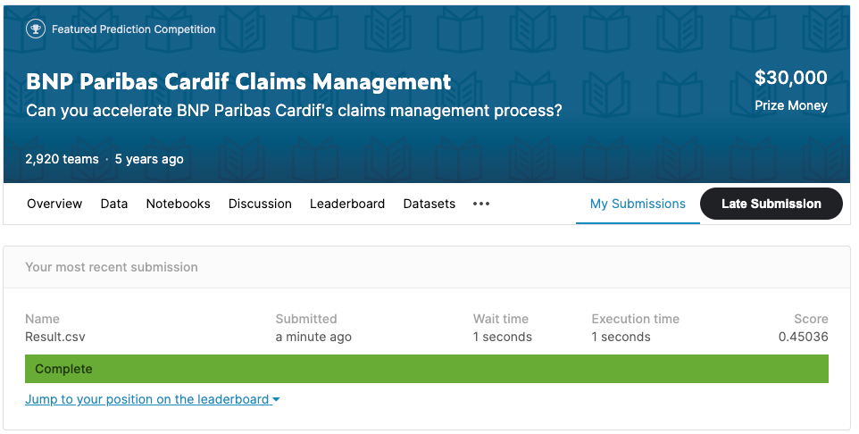
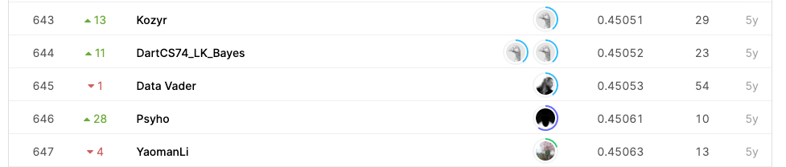

# BNP Paribas Cardif Claims Management

## 결과

### 요약정보

- 도전기관 : 한양대학교
- 도전자 : 왕흠원
- 최종스코어 : 0.45036
- 제출일자 : 2021-01-22
- 총 참여 팀 수 : 2920
- 순위 및 비율 : 646 (22.12%)

### 결과화면

## 사용한 방법 & 알고리즘

- 

## 코드

[code](bnp.py)

## 참고 자료

- 
