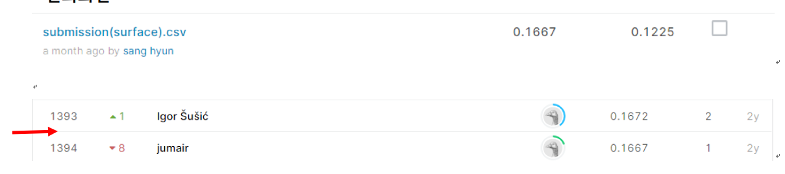

# CareerCon 2019 - Help Navigate Robots

## 결과

### 요약정보

- 도전기관 : 시큐레이어
- 도전자 : 김상현
- 최종스코어 : 0.1667
- 제출일자 : 2021-01-22
- 총 참여 팀 수 : 1443
- 순위 및 비율 : 1394(97.00%)

### 결과화면

## 사용한 방법 & 알고리즘

LSTM 모델을 사용하였습니다.

- Feature engineering
  - z-score 노멀라이징 
  - class별 평균 피쳐 생성
  - class별 분산 피쳐 생성

## 코드

['./career-con-2019.py'](./career-con-2019.py)

## 참고 자료

