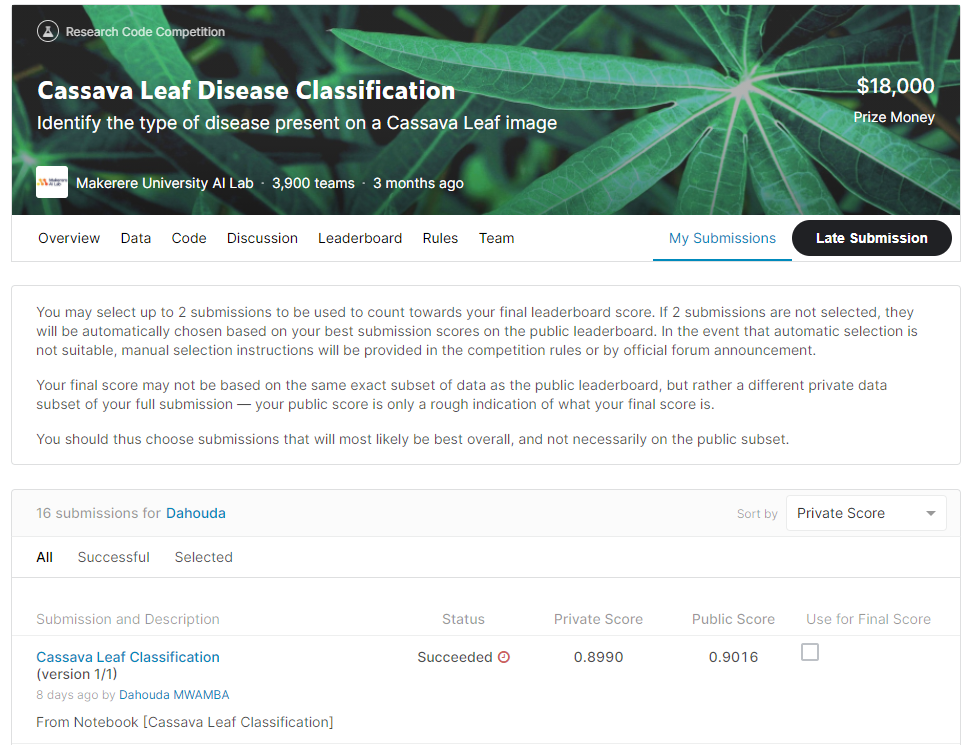
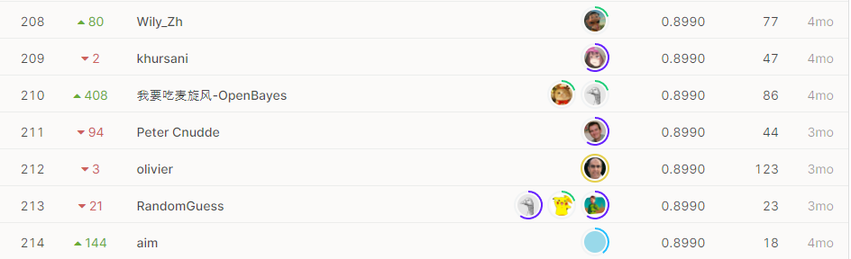

# Cassava Leaf Disease Classification

## 결과

### 요약정보

- 도전기관 : 한양대학교
- 도전자 : MWAMBA KASONGO Dahouda
- 최종스코어 : 0.8990
- 제출일자 : 2021-05-05
- 총 참여 팀 수 : 3900
- 순위 및 비율 : 208(5.33%)

### 결과화면

## 사용한 방법 & 알고리즘

간단한 뉴럴 네트워크 모델을 사용했습니다.

- Image Preprocessing : Data Augmentation
  Image data augmentation layers with Keras : These layers apply random augmentation transforms to a batch of images. They are only active during training.
      - RandomCrop layer
      - RandomFlip layer
      - RandomRotation layer
      - RandomZoom layer
      - RandomConstrast layer
  Neural Network : Transfer Learning 
      use pre-trained model

## 코드

[`./caassava-leaf-disease-classific.ipynb`](./caassava-leaf-disease-classific.ipynb)

## 참고 자료

- [Image data augmentation layers with Keras](https://www.tensorflow.org/guide/keras/preprocessing_layers)
