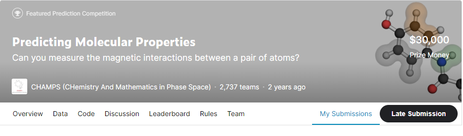
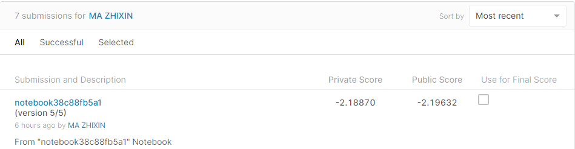
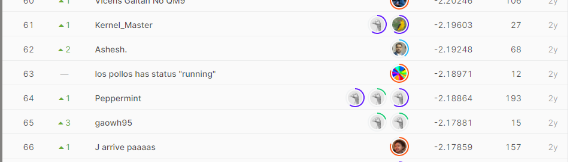

# Predicting Molecular Properties

## 결과

### 요약정보

- 도전기관 : 한양대학교
- 도전자 : 마지흔
- 최종스코어 : -2.18870
- 제출일자 : 2021-03-09
- 총 참여 팀 수 : 2737
- 순위 및 비율 : 64(2.34%)

### 결과화면

## 사용한 방법 & 알고리즘

Feature Engineering

LightGBM

loss function:MAE

Nerual Network

## 코드

[`./champs-challenge.ipynb`](./champs-challenge.ipynb)

## 참고 자료