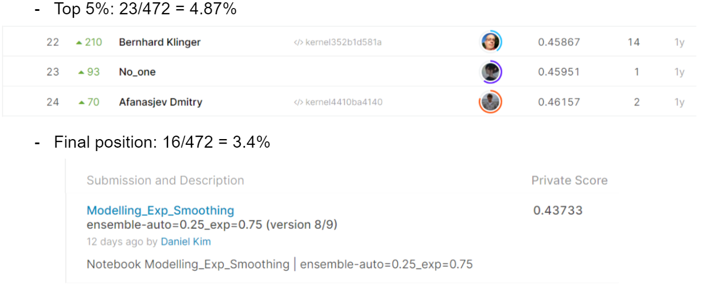

# Facebook V: Predicting Check Ins
## 결과
### 요약정보
- 도전기관: 한양대학교
- 도전자: 김진훈
- 최종스코어: 0.43733
- 제출일자: 2021-08-18
- 총 참여 팀수: 472
- 순위 및 비울: 3.4%
### 결과화면

## 사용한 방법 & 알고리즘
- Preprocessing: index locations by geo (combination of country and province)
- Ensemble of Exponential Smoothing and Auto Arima
  - For each geo the best hyperparameters for each model were found by cross validation
## 코드
[`./covid19-global-forecasting-week-4.ipynb`](./covid19-global-forecasting-week-4.ipynb)
## 참고 자료
- The code was developed by the author