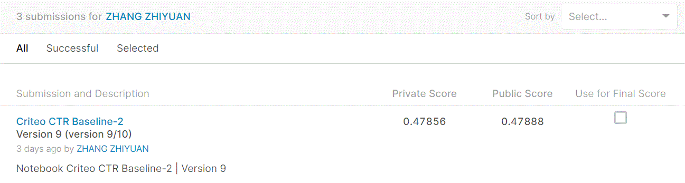
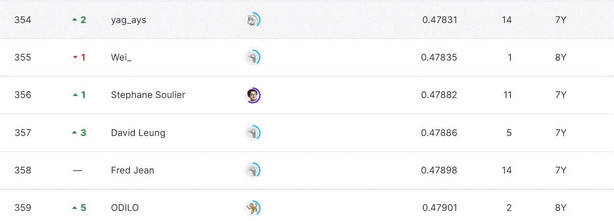

# Display Advertising Challenge

## 결과

### 요약정보

- 도전기관 : Hanyang University
- 도전자 : 장지원
- 최종스코어 : 0.47856
- 제출일자 : 2022-02-09
- 총 참여 팀 수 : 717
- 순위 및 비율 : 356(49.65%)

### 결과화면

## 사용한 방법 & 알고리즘

Read data from the dataset as evenly as possible. 
For object features, some features with fewer occurrences are merged to make the number of training set and test set consistent.
For numerical features, fill in the nan values with the mean of each column of data.
using the catboost train the model.
Only the most important top 70% of features are kept.
## 코드
['criteo-display-ad-challenge.ipynb'](./criteo-display-ad-challenge.ipynb)
## 참고 자료
